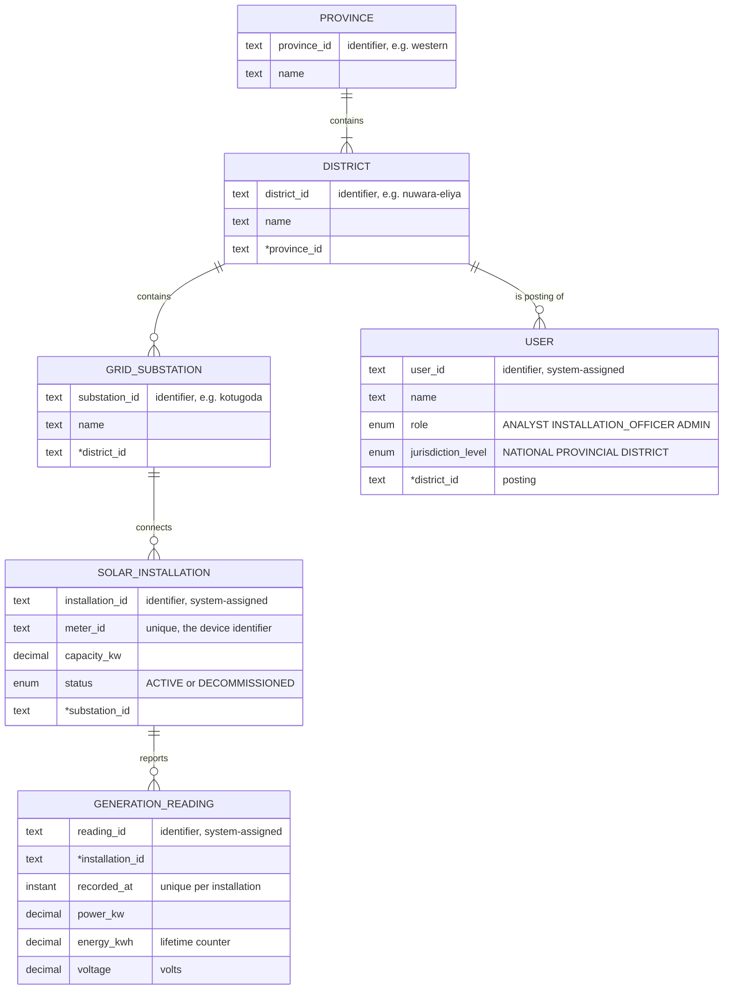

# Step 1 — Data Model (Design Log)

**Project:** NB6007CEM — Real-Time Solar Generation Data API (SLSEA)
**Design authority:** WSO2 REST API Design Guidelines (cited as **G§x**). Then the Brief (**B§x**) and the Rubric (**R-Dx** = rubric dimension x).
**Status:** v5.7 (meter swap: the replacement meter continues the old counter — commissioning rule, A3, D10) · v5.6 (storage: MongoDB; test accounts through the API — A6, D19, N6) · v5.5 (decommissioning revokes the device credential; bootstrap ADMIN is `hq.admin`; 03 v6 references) · v5.4 (substations readable by every user) · v5.3 (in-memory store: A6, D19, N6) · v5.2 (cross-check: API wording removed from D8/D11, rule values filled in, hand-off updated) — three roles (ANALYST, INSTALLATION_OFFICER, ADMIN), users created through the API, installation lifecycle status, derived reporting status.

> These are working notes. The report itself must be written in your own words (Turnitin AI score must stay below 15%). Use this log as the source of reasons, not as report text.

### What changed in v5
- **Role renamed:** REGISTRAR → **INSTALLATION_OFFICER**. Plainer for any reader, and it avoids confusion with the outside solar installer companies (D7, S1).
- **New role ADMIN:** creates, changes and removes user accounts. Always NATIONAL (v5.1: D7, D19, R13).
- **Users are not seeded.** They are created through the API by an ADMIN. Only the first ADMIN is created once at deployment (A6, D19).
- **SolarInstallation gets `status` (ACTIVE / DECOMMISSIONED)** — re-added for a different reason than the one removed in v4: a site that stops operating must stop writing and stop looking live, while its history stays (D12 revised, R14).
- **Reporting status** (is the device still sending?) added as a **derived** value, never stored (D13, A14).

### What changed in v4
- Simpler names: `capacity_kw`, `recorded_at`, `voltage`.
- Attributes that point at another entity are marked with `*` (e.g. `*substation_id`).
- `reading_id` restored as the reading's identifier; (installation, `recorded_at`) stays unique (D8).
- SolarInstallation is now just `installation_id`, `meter_id`, `capacity_kw`, `*substation_id`. `commissioned_on` and `status` removed; an installation with readings cannot be deleted (D12).

### What changed in v3
- Removed `created_at` / `updated_at`, `received_at`, `reading_id`, and User `status`/`username`. They existed to support HTTP behaviour (Last-Modified, Location) or login, not to describe the domain. That fails G§3 and "clients win over data" (D16).
- A reading was identified by its installation + time (superseded in v4: `reading_id` restored).
- The useful insights are kept as notes for later steps (section 14).

### What changed from v1 (in v2)
- User jurisdiction is now **one posting district + a level**, following the lecture pattern (D6, S2).
- The registry role (called REGISTRAR until v5, now **INSTALLATION_OFFICER**) manages **installations only** (D7, S1, S3).
- Substations are **reference data**, read-only through the API, with readable identifiers (D15, S4).
- Old rule R11 replaced; open questions resolved (section 13).

---

## 0. Where this step sits

- G§2 (Figure 1) gives seven steps. This is **step 1: Create Data Model**. Resources, URIs, methods and so on come later and are derived from this.
- G§3 says the data model must be:
  - written in a conceptual language (we use an **Entity-Relationship model**),
  - **implementation independent** — no format, no media type, no database decisions.
- So this document has **no** tables, SQL types, indexes, JSON, or URLs. Attributes marked `*` name a related record (see §2).
  - Attribute types are conceptual only: *text, decimal, date, instant (a point in time), enumeration*.
  - Attribute names are conceptual labels. JSON field naming is decided later at the representation step (G§6).
- **Deliberately left for implementation** (so nobody can say the model decided them):
  - storage technology (relational, document, time-series database),
  - keys, foreign keys, indexes, constraints as database objects,
  - exact data types and precision (e.g. how many decimal places for kW),
  - how identifiers are generated (UUID, sequence, etc.),
  - how the large readings history is physically stored (partitioning, retention),
  - how passwords and device secrets are stored,
  - bookkeeping fields: record creation/change times, arrival times, version counters for ETags (D16).
- G§2 and G§3 also say resources will **not** map one-to-one to entities ("clients win over data"). So the "last-known reading" and the "district summary" are **not** entities here. They are derived later (D13).

---

## 1. Entities at a glance

| # | Entity | What it is | Kind |
|---|---|---|---|
| 1 | Province | One of Sri Lanka's 9 provinces. Top-level jurisdiction. | Reference data |
| 2 | District | One of the 25 districts. Mid-level jurisdiction, and where users are posted. | Reference data |
| 3 | GridSubstation | The utility's grid node that installations connect to. | Reference data |
| 4 | SolarInstallation | A rooftop solar site. The thing being metered. Also the **write-principal** (its device logs in as it). | Asset registry |
| 5 | GenerationReading | One timestamped measurement sent by an installation's device. | Append-only time series |
| 6 | User | An SLSEA person with a role, a posting and a jurisdiction level. The **read-principal** for generation data; some roles also look after installations or user accounts (D7). | Principal |

- Exactly the five-entity hierarchy plus User that B§3 asks for. Nothing extra.
- **No Device entity** (D1). **No last-value fields** on the installation (D2, D13).

---

## 2. Entity-Relationship diagram

Legend: a `*` before an attribute means it **refers to another entity** (the record this one belongs to). The comment beside an attribute says if it is the **identifier** or must be **unique**. Crow's-foot ends show cardinality.

- Attributes marked `*` name the related record (a reading's `*installation_id` says which installation sent it). This matches G§6: a resource's information content is its attribute values "and - if appropriate - the identifiers of associated resources". How these references are stored is decided at implementation.

---

## 3. Relationships and cardinalities

Read as: "one LEFT has MIN..MAX RIGHT" and "one RIGHT belongs to MIN..MAX LEFT".

| Relationship | Left side | Right side | Why these numbers |
|---|---|---|---|
| Province contains District | 1 province has **1..\*** districts | each district in **exactly 1** province | Fixed national geography. Every province has districts. A district can never sit in two provinces. |
| District contains GridSubstation | 1 district has **0..\*** substations | each substation in **exactly 1** district | The brief's seed (20+ substations, 25 districts) means a district *may* have none, so the model allows it. Our seed gives every district at least one (S6). See A2 for "exactly 1". |
| GridSubstation connects SolarInstallation | 1 substation has **0..\*** installations | each installation on **exactly 1** substation | A substation may have no sites yet. A rooftop site feeds one grid node. |
| SolarInstallation reports GenerationReading | 1 installation has **0..\*** readings | each reading from **exactly 1** installation | A just-registered site has no readings until its device first reports. The "last-known reading" must handle "none yet". |
| District is posting of User | 1 district has **0..\*** users posted | each user posted to **exactly 1** district | Every SLSEA person works from an office in one district (A11). Their level decides how far up from it they can see (D6). |

- The chain Province → District → Substation → Installation → Reading is a **strict tree**. Every reading has exactly one path to exactly one province. That keeps jurisdiction checks simple and leak-free (D4).
- Users hang off the **same tree** (at district level), so "is this reading inside this user's area?" is answered by comparing two positions in one tree.

---

## 4. Attributes, entity by entity

### 4.1 Province

| Attribute | Type | Req. | Why |
|---|---|---|---|
| province_id | text | Yes | Identifier. A readable code made from the official name (`western`, `north-western`). See D15. |
| name | text | Yes | Display name (`North Western`). |

### 4.2 District

| Attribute | Type | Req. | Why |
|---|---|---|---|
| district_id | text | Yes | Identifier. A readable code made from the official name (`colombo`, `nuwara-eliya`). See D15. |
| name | text | Yes | Display name. |
| `*province_id` | reference | Yes | The province it belongs to. Exactly one. |

### 4.3 GridSubstation

| Attribute | Type | Req. | Why |
|---|---|---|---|
| substation_id | text | Yes | Identifier. A readable code made from the substation's name (`kotugoda`). Reference data, so a readable identifier (D15). |
| name | text | Yes | Name analysts recognise. |
| `*district_id` | reference | Yes | The district it is in. Exactly one. |

- Kept small on purpose. Voltage class, transformer rating etc. have no consumer in the brief (D17).
- Read-only through the API: owned by the utility, not SLSEA (S4).

### 4.4 SolarInstallation

| Attribute | Type | Req. | Why |
|---|---|---|---|
| installation_id | text | Yes | System-assigned identifier. **Not** the meter id (D3). |
| meter_id | text | Yes, unique | Identifier of the smart meter or inverter that reports for this site. An **attribute**, not an entity (D1). |
| capacity_kw | decimal (> 0) | Yes | Rated output of the system in kW. Lets us reject impossible readings (R5) and lets dashboards compare output against size. |
| status | enum: ACTIVE, DECOMMISSIONED | Yes | Whether the site is in service. A DECOMMISSIONED site keeps its history, accepts no new readings and is left out of "current" figures (D12, R14). |
| `*substation_id` | reference | Yes | The substation it connects to. Exactly one. District and province are **reached through this**, never stored again (D4). |

- **Not here on purpose:** `last_power`, `last_reading_time`, `today_energy`, reporting status, `district`, `province`, decommission date, owner name, address, GPS. See D2, D4, D12, D13, D14.

### 4.5 GenerationReading

The brief's minimum (B§3): owning installation, a timestamp, power (kW), cumulative energy (kWh), voltage — plus the reading's own identifier (D8, D9).

| Attribute | Type | Req. | Why |
|---|---|---|---|
| reading_id | text | Yes | System-assigned identifier (D8). |
| `*installation_id` | reference | Yes | The installation that sent it. Exactly one. Always the authenticated device's own installation (R10). |
| recorded_at | instant | Yes | When the device **took the measurement** (the brief's "timestamp") — not when it arrived. Unique per installation (D8). Sorting, time-window filters and "latest" all use this. |
| power_kw | decimal (≥ 0) | Yes | Instantaneous power at `recorded_at`. Drives the operational ("now") view. |
| energy_kwh | decimal (≥ 0) | Yes | Meter's **lifetime cumulative** energy counter. Drives "energy today" (D10). |
| voltage | decimal (> 0), volts | Yes | Grid-side AC voltage at the connection point. Indicates grid health at the site. |

- `_kw` and `_kwh` stay in the names because W/kW and Wh/kWh are easy to mix up. Voltage is always in volts.

### 4.6 User

| Attribute | Type | Req. | Why |
|---|---|---|---|
| user_id | text | Yes | System-assigned identifier. |
| name | text | Yes | The person's name. |
| role | enum: ANALYST, INSTALLATION_OFFICER, ADMIN | Yes | **What** the person may do (D7, S3). One role per person. |
| jurisdiction_level | enum: NATIONAL, PROVINCIAL, DISTRICT | Yes | **How far** up the tree from their posting they can see (D6, S2). |
| `*district_id` | reference | Yes | The district they are posted to. Exactly one (A11). |

- Login names, passwords and device secrets are **not** in the conceptual model, even though users are now created through the API. They exist only so the system can log people in (the D16 test), so they belong to the security step (G§12).

---

## 5. Decision log

Each decision: what we chose, what else we considered, and why. These are the reasons you defend at viva.

### D1 — The meter is an attribute (`meter_id`), not a Device entity
- **Options:** (a) separate Device entity linked to the installation; (b) `meter_id` attribute on SolarInstallation.
- **Chosen:** (b).
- **Why:**
  - B§3 states it directly, and R-D1 names a needless Device entity as a lower-second flaw.
  - The device "authenticates **as that installation**" (B§2). It has no identity of its own in this system.
  - Nothing in the brief needs device data (firmware, model, swap history). A Device entity would hold one useful field.
- **Trade-off:** a meter swap just updates `meter_id`. No history of past meters. Fine for this scope.

### D2 — Readings are an append-only time series, not last-value fields
- **Options:** (a) `last_power`, `last_energy` on the installation; (b) a GenerationReading entity, one instance per report, never overwritten.
- **Chosen:** (b).
- **Why:**
  - B§3: last-value fields "destroy the historical (analytical) capability". The analytical scope (B§6) needs history by time and region.
  - R-D1 First band requires it.
  - The "what now" view still works: it is simply the newest reading (D13). (b) serves **both** scopes; (a) serves one.
- **Append-only means:** once recorded, a reading is never changed or deleted through the API (R3).

### D3 — The installation has its own identity, separate from `meter_id`
- **Options:** (a) `meter_id` as identifier; (b) a separate system-assigned `installation_id`.
- **Chosen:** (b).
- **Why:** the **site** outlives the **hardware**. With (a), replacing a failed meter changes the site's identity and splits its history in two.

### D4 — An installation's district and province are reached **only** through its substation
- **Options:** (a) also store district/province on the installation; (b) link only to the substation and walk up the tree.
- **Chosen:** (b).
- **Why:**
  - B§3 defines a single chain: province → district → substation → installation.
  - One path = one answer. Two stored copies could disagree, and then a district user might see an installation through one path but not the other — the **cross-jurisdiction leakage** R-D7 punishes.
  - Copying the district down for speed is a database decision for later, not a modelling decision (G§3).
- **Assumption this needs:** A2.

### D5 — Devices are not Users. Two separate kinds of principal.
- **Options:** (a) each device is a User with role DEVICE; (b) the installation is the write-principal; User is only for SLSEA people.
- **Chosen:** (b).
- **Why:**
  - B§2: producer and consumer "are different parties with different permissions. This split drives your entire security model."
  - (a) mixes the two parties, needs 200+ fake users, and is a Device entity in disguise (D1).
  - With (b) the split is visible in the model: SolarInstallation **writes**, User **reads**. That is R-D1's "write and read concerns are cleanly separated".
  - This split is about **generation data**: readings have exactly one writer, and it is never a person. Looking after the installation registry and user accounts is a separate, administrative concern handled by SLSEA roles (D7).

### D6 — Jurisdiction: one posting district + a level (lecture pattern, translated)
- **Lecture pattern:** every officer is stationed at a station; the role says how far up from that station they see.
- **Translation:** in this domain the lowest jurisdiction unit is the **district** (a substation is equipment, not a workplace). So every SLSEA user is **posted to exactly one district**, and `jurisdiction_level` says how far up from it they see.
- **Options:** (a) level + optional link to a province **or** a district (v1); (b) posting district + level; (c) link users to a substation.
- **Chosen:** (b).
- **Why:**
  - **No wrong combinations can exist.** (a) allowed "provincial but linked to a district", "linked to both", "linked to neither", and needed an extra rule to forbid them. (b) always has exactly one link.
  - It follows the taught pattern, translated to the right level for this domain.
  - Promotion changes only the level; the posting stays.
  - (c) copies the lecture's word without its meaning.
- **Visible area:**
  - DISTRICT → the posting district.
  - PROVINCIAL → every district in the posting district's province.
  - NATIONAL → everything.
- **Assumptions:** A11, A12, A13. **Trade-off:** someone posted in one province cannot be assigned to cover another (would need a separate assignment entity; out of scope).

### D7 — Roles: ANALYST, INSTALLATION_OFFICER and ADMIN
- **The gap in the brief:**
  - "Full CRUD on the write path" (B§5, R-D3) cannot live on readings (append-only, D2), and devices "can write nothing else" (B§2).
  - Someone must **register** installations, or no device has an installation to log in as.
  - Users are not seeded (A6), so someone must also **create user accounts** (D19).
- **Chosen:**
  - `ANALYST` — reads inside their area. Covers "analysts and regional operators" (A7).
  - `INSTALLATION_OFFICER` — everything an analyst can, **plus** register, correct, decommission and remove **installations** inside their area, and issue their device credentials.
  - `ADMIN` — creates, changes and removes **user accounts**. Always at level `NATIONAL` (R13), because account management is a head-office function covering every posting (D19). Sees geography (to choose a posting) but **no generation data**.
  - None of them ever writes readings (R12).
- **Why the name INSTALLATION_OFFICER (was REGISTRAR in v4):**
  - It says plainly what the person looks after: installations. "Registrar" needs explaining to most readers.
  - "Officer" is the usual title for staff of a government authority such as SLSEA.
  - Not "INSTALLER": that word means the outside companies that fit the panels (S1), which are deliberately **not** clients. Using it for SLSEA staff would blur exactly the line S1 draws.
- **Why an INSTALLATION_OFFICER, not an installer client:** the brief allows exactly two kinds of client. Installer companies would be a third, external party needing per-record ownership rules (scope creep). Full reasoning in S1.
- **Why ADMIN is a separate role (least privilege):**
  - Keeping the asset registry and handing out access are different duties. If one role did both, whoever can create accounts could give themselves wider access **and** change installations.
  - ADMIN does not need generation data to manage accounts, so it gets none.
  - **Trade-off:** one role per person. Someone doing two jobs needs two accounts. Fine for this scope; noted as a limitation.
- **Why role is separate from level:** a district analyst and a district installation officer see the same area but have different powers (S3).
- **Where the two names come from:** both are in the brief.
  - **Role:** B§2 "SLSEA **analysts** and regional operators then query that data" → `ANALYST`. Officers and admins are the roles we add (D7 gap above).
  - **Level:** B§2 "**National, provincial, and district** users read data, scoped by their jurisdiction" → `jurisdiction_level`.
  - B§3 then defines a user as "an SLSEA person with **a role and a jurisdiction**". The brief describes the same people along two axes; the model stores the two axes.
- **Considered and rejected: one combined role list** (NATIONAL, PROVINCIAL, DISTRICT, INSTALLATION_OFFICER, ADMIN), with officers fixed to their district and admins fixed to national.
  - It fails four tests of a clean attribute:
    1. **One attribute, one question.** `role` would answer "how far" for three values and "what you do" for two.
    2. **Values of one kind.** `DISTRICT` (a breadth) and `ADMIN` (a duty) would sit in the same list.
    3. **No rule hidden in code.** "Officers are district-level, admins are national" would exist only as `if` statements, invisible in the model.
    4. **Every combination is meaningful, or ruled out by a stated rule.** A provincial officer could not be stored at all. (With two fields, the one combination we do not want — an ADMIN below NATIONAL — is excluded by an explicit rule, R13, not by code.)
  - It does not remove the jurisdiction level; it moves it from the data into the code.
  - B§3 itself defines a user by "**a role and a jurisdiction**" — two properties, modelled as two.
  - The lecture could merge them because every tuk-tuk user only read (one dimension). Once some users write, there are two dimensions (§12.2 point 4).
- **Storing these facts is a modelling decision; enforcing them is not.** The model holds what a person *is* (role, level, posting), because it is on their appointment letter (passes the D16 test). The security step turns those facts into token scopes and checks them on each request. Without the facts in the model, the implementation would have nothing to check against.
- **Why officers manage installations only:** substations are utility-owned reference data (S4).

### D8 — A reading has its own identifier, and (installation, `recorded_at`) is unique
- **Options:** (a) a `reading_id` plus a uniqueness rule; (b) no id — identify a reading by installation + time (an ER weak entity, tried in v3).
- **Chosen:** (a).
- **Why:**
  - Every entity then has one simple identifier of its own. Uniform and easy to explain.
  - The uniqueness rule keeps the real-world meaning: one installation cannot have two readings for the same instant (R4).
  - A meter that loses its connection may send the same measurement again. Without the rule, the same energy would be counted twice and every total would be wrong.
- **Note:** (b) is also valid ER. We prefer (a) for simplicity. How the API answers a resend (03 M6) and how a reading appears in a URI (03 R4) are API decisions, made later.

### D9 — Readings carry the brief's five properties plus an identifier, nothing else
- **Chosen:** the brief's five (`*installation_id`, `recorded_at`, `power_kw`, `energy_kwh`, `voltage`) plus the identifier `reading_id` (D8). Nothing more.
- **Why:** B§3 allows extra fields only if justified. v2 added `received_at` (arrival time). Its real reason was keeping conditional GET correct when buffered readings arrive late — an HTTP caching concern, not a domain property. So it moves to the implementation notes (section 14, N1), where it still gets built.

### D10 — Energy is a lifetime cumulative counter
- **Options:** (a) energy in this interval; (b) running total since installation.
- **Chosen:** (b), as B§3 says "cumulative".
- **Why it is also the better design:** "energy today" = latest counter today − last counter before midnight. Lost readings do not lose energy. With (a), every lost reading is lost energy.
- **Rule:** never decreases (R6).
- **Meter replacement:** the replacement meter is set to continue the old meter's counter when it is fitted (commissioning rule, A3). The site keeps one unbroken counter, so R6 and "energy today" need no special case. A meter that cannot be set this way cannot report for the site — a stated limitation (02 L6).

### D11 — Time is stored as absolute instants; "today" means the Sri Lanka day
- Every time value is an **instant**. Day boundaries are computed in **Sri Lanka time, UTC+05:30**, no daylight saving.
- **Why:** SLSEA works on the Sri Lanka calendar day. An instant is the same everywhere, so storing instants never shifts a reading; only the day boundary needs a time zone. Using any other zone for "today" (for example UTC) would start the SLSEA day at 05:30 local time and give wrong totals.

### D12 — An installation has a lifecycle status, and can be deleted only if it has no readings (revised in v5)
- **Two things must both hold:**
  1. Readings depend on their installation. Deleting a site that has readings would destroy its history — the thing D2 protects.
  2. Real sites do stop: panels removed, house demolished, owner leaves the scheme. Such a site must stop writing **and** stop looking like a live site.
- **Options:**
  - (a) delete cascades to readings;
  - (b) delete only when there are no readings, nothing else (the v4 choice);
  - (c) a lifecycle `status` (ACTIVE / DECOMMISSIONED) instead of deleting;
  - (d) (c) **plus** (b): status for real sites, delete only for registrations made by mistake.
- **Chosen:** (d).
- **Why v4's (b) alone was not enough:** walking the full lifecycle of a site showed that, under (b), a shut-down site stays registered as a normal site for ever. Revoking its credential stops writes, but the site still looks live:
  - its reporting status (D13) would show **SILENT** for ever, so operators chase a site that is meant to be off;
  - district site counts would still include it, overstating the district.
  - These are wrong numbers in operational resources, so (c) passes SC §0 test 3 (prevents a real fault).
- **Why `status` is a domain property, not bookkeeping:** apply the D16 test — *"Would this exist without an HTTP API?"* Yes. Whether a grid-connected site is in service is something an energy authority records on paper today. Compare `updated_at`, which fails the test. This is why `status` was right to remove in v4 (no reason then) and right to add now (a real need).
- **Why (a) is still rejected:** it silently loses analytical history.
- **Rules that follow:**
  - A new installation starts ACTIVE.
  - A DECOMMISSIONED site accepts **no new readings** (R14). Its history stays readable.
  - It is left out of "current" figures: current power, site counts, reporting status. Energy it produced **earlier today** still counts in today's energy, because that comes from its readings (D10).
  - An installation officer may set it back to ACTIVE (for example, decommissioned by mistake). A different system later fitted on the same roof is a **new** installation.
  - Delete stays only for registrations made by mistake, before any reading arrived (R9).
  - Decommissioning also **revokes the device credential**; reactivating needs a new one (03 A11, §9.3).
- **Kept small on purpose:** no decommission date, no reason code, no status history. Nothing in the brief consumes them (D17).
- **Trade-off (for critical evaluation):** we know that a site *is* decommissioned, not *when*. The time of its last reading is a reasonable stand-in.

### D13 — Derived values are not stored

| Derived value | Computed from | Later becomes |
|---|---|---|
| Last-known reading | the reading with the newest `recorded_at` | operational per-installation resource (B§5) |
| Energy today (installation / district) | counter differences, Sri Lanka day (D10, D11) | part of the district summary |
| Current total power of an area (district, province or national) | latest reading of each ACTIVE, reporting installation in the area | generation summary at every jurisdiction level (B§5 stretch) |
| An installation's district and province | walk up the tree (D4) | context in the installation composite |
| Reporting status of an ACTIVE installation: REPORTING, SILENT or NEVER_REPORTED | time of the newest reading compared with now | installation composite, installation filter, summary counts |
| A user's visible area | posting district + level (D6) | security checks |

- **Why:** G§2 — resources are *derived*, no one-to-one match with the model. G§4.5 — processing resources come from functional needs. Storing these would bring back last-value fields (D2) and values that go stale.

- **Silent is not the same as zero output.** At night a working device still sends readings with 0 kW (A14). SILENT means **no reading has arrived** for more than two reporting intervals (SC G2), not that the panels produce nothing.

### D14 — No personal data about the household owner
- No owner name, phone, address or GPS.
- **Why:** no consumer needs it (dashboards work by region, which comes from the substation). Data never collected cannot leak — the spirit of Sri Lanka's Personal Data Protection Act (No. 9 of 2022).
- **Trade-off:** no map of individual rooftops.

### D15 — Readable identifiers for reference data, system identifiers for everything else
- **Province, District, GridSubstation** → a readable code made from the official name (`western`, `nuwara-eliya`, `kotugoda`).
- **Installation, Reading, User** → system-assigned, opaque, never reused.
- **Why the split:**
  - Reference data is fixed and is not created through the API (S4). Readable identifiers make filters self-explaining later (`colombo` instead of `17`).
  - How these codes appear in URIs is an API decision (03 U3–U6). The model only fixes that they are **stable** and **readable**.
  - Installations and people are created, renamed and retired. Names make bad identifiers for them.
- **Rejected:** numeric ids for geography (meaningless to analysts); ISO 3166-2:LK codes (`LK-11`), official but unreadable without a lookup.
- **Rule for seed:** if two substations share a name, add the district to the code.

### D16 — Bookkeeping fields are not part of the data model
- **Removed in v3:** `created_at` / `updated_at` (installation, user), `received_at` (reading), user `username` and `status`. (`reading_id` was also removed in v3, then restored in v4 for simplicity — D8.)
- **Why:**
  - G§3: the data model specifies "the properties of the resources" abstractly. *When a database row was written* is not a property of a solar installation. *How big the system is* is — and that is `capacity_kw`.
  - Lecture principle: "the data model drives the implementation". Last-Modified, ETag and Location are HTTP mechanisms decided at the headers and special-behaviour steps (G§2, G§8, G§10.4). Putting their supporting fields here would let the API leak backwards into the model.
  - Our own scope test (S0): none of them is required by the brief as a domain property. They are needed only to make an **API behaviour** work, and that is handled where the behaviour is designed.
- **Nothing is lost:** each one is recorded in section 14 so it is built at the right step.
- **The test, for viva:** *"Would this attribute exist if the system had no HTTP API at all?"* `capacity_kw` — yes. `updated_at` — only as database plumbing. So it is implementation.

### D17 — Fields deliberately **not** added

| Not added | Why not |
|---|---|
| Grid frequency, panel temperature, irradiance | No consumer needs them. Each added field must be justified (B§3). |
| Reporting interval per installation | The brief says a fixed interval (A1). |
| Substation capacity / voltage class | No consumer needs it. |
| Owner details | D14. |

- Point for the report: the model is as small as the brief allows, and **every** addition has a stated reason.

### D18 — No relationship between User and SolarInstallation ("registered by")
- **Options:** (a) link each installation to the installation officer who created it; (b) no link — installation officers act on installations through their **area**, not through **ownership**.
- **Chosen:** (b).
- **Why:**
  - **Permissions don't use it.** An installation officer may change *any* installation in their area (role + posting + level, D6, D7). Who created the record never affects any decision. A link nothing uses is dead data.
  - **Using it would be scope creep.** "Only the installation officer who created it may edit it" is a per-record ownership rule — attribute-based access control (G§12.3), which we deliberately did not build (S1).
  - **It fails the D16 test.** "Who created this record" is provenance — bookkeeping about the system, not a property of the solar site. It would not exist without the system.
  - **It breaks the clean model.** B§3 links User to the data only by "read scope by jurisdiction", and R-D1 asks for a clean "five-entity hierarchy plus User". Users already attach to the tree at district level (D6). A second User→Installation path crosses the hierarchy.
  - **It ties assets to staff.** Installation officers come and go; installations stay for decades. If an installation officer's record is removed, the installation would point at nothing.
  - **It breaks the seed.** Installations are seeded but users are not (A6). Seeded installations would point at users that do not exist.
- **What about accountability ("who changed this?")?** A real concern for a government registry, but it is an **audit log** — an implementation concern, not a domain relationship (N5). Noted as future work.

---

### D19 — Users are created through the API by a national ADMIN
- **Why user management at all:** User is part of the brief's model (B§3). In a working authority, staff join, get promoted, move postings and leave. Without user management the jurisdiction model only works for a fixed, hand-made set of people (SC §0 test 4).
- **Options for who creates users:**
  - (a) seed them only;
  - (b) an ADMIN role;
  - (c) installation officers also manage users;
  - (d) self sign-up.
- **Chosen:** (b).
- **Why not the others:**
  - (a) real staff change, and the marker cannot see account management working.
  - (c) mixes two duties (D7).
  - (d) anyone could claim any area, which breaks jurisdiction scoping at the root.
- **ADMIN is always NATIONAL (v5.1).**
  - Account management is a head-office function: the person who creates a Kandy analyst also creates a Jaffna one. A "district admin" has no real-world counterpart in the brief.
  - v5 allowed regional admins and needed an extra rule ("never give anyone a level above your own"). That rule only existed because of the regional-admin option; removing the option removes the rule. Simpler model, same safety.
  - It is a **stated rule in the model** (R13), so test 3 in D7 still holds: nothing is hidden in code. The store enforces it on every write.
- **Rules (R13):**
  - An ADMIN's `jurisdiction_level` is always `NATIONAL`.
  - An ADMIN never changes or removes their own account. This stops self-promotion out of the role and stops the last ADMIN locking everyone out.
- **Attribute-based control is still built:** the area check itself compares the **caller's** posting and level with the **asset's** district ("a Colombo user cannot read Kandy"). A scope alone cannot express that (G§12.3), so R-D7's scope-vs-ABAC discussion has a working example, next to the unbuilt installer example (S1).
- **Bootstrap:** the first ADMIN (`hq.admin`, NATIONAL) is created at start-up from secret deployment settings — the usual bootstrap-admin pattern. It is not seed data: the seed covers domain data only (B§4).
- **Marker's test accounts:** created once through the API by `hq.admin`, like any other account; the database keeps them (N6).
- **Removing a user is safe:** nothing in the model refers to a user (D18), so deleting one never leaves broken links.

---

## 6. Business rules (invariants)

| # | Rule |
|---|---|
| R1 | Strict tree: every district has one province, every substation one district, every installation one substation, every reading one installation, every user one posting district. |
| R2 | `meter_id` is unique across all installations. |
| R3 | A reading is immutable: never updated or deleted through the API. |
| R4 | (installation, `recorded_at`) is unique. |
| R5 | `power_kw` ≥ 0 and not above `capacity_kw` plus a small tolerance (set at 5% in the API, 03 M5). |
| R6 | `energy_kwh` ≥ 0 and never decreases over time for the same installation. |
| R7 | `voltage` > 0 and inside a plausible band for Sri Lanka's 230 V supply (set at 180–270 V in the API). |
| R8 | `recorded_at` is not in the future (2-minute clock-skew allowance) and not more than 7 days old (02 G6). |
| R9 | An installation that has readings cannot be deleted; it is decommissioned instead (D12). |
| R10 | A reading's installation is **always** the one the device authenticated as — never taken from the request content. |
| R11 | A user's visible area is derived from posting + level (D6) and is never stored separately. |
| R12 | Users never create readings. Devices change nothing except adding readings for their own installation. An installation officer acts only on installations inside their area; an ADMIN on any user account. |
| R13 | An ADMIN is always at level NATIONAL, and never changes or removes their own account (D19). |
| R14 | A DECOMMISSIONED installation accepts no new readings (D12). |

---

## 7. Write vs read separation (summary)

| Data | Created by | Changed by | Removed by | Read by |
|---|---|---|---|---|
| Province, District | Loaded as reference data | Nobody (via API) | Nobody | Any logged-in user (S5) |
| GridSubstation | Loaded as reference data | Nobody (via API) | Nobody | Any user (public reference data, S5) |
| SolarInstallation | INSTALLATION_OFFICER, in area | INSTALLATION_OFFICER, in area (including `status`) | INSTALLATION_OFFICER, only if it has no readings; otherwise decommissioned (D12) | ANALYST and INSTALLATION_OFFICER in their area |
| GenerationReading | **Only that installation's device**, and only while ACTIVE (R14) | Nobody (R3) | Nobody (R3) | ANALYST and INSTALLATION_OFFICER in their area |
| User | ADMIN (D19) | ADMIN, never own account | ADMIN, never own account | ADMIN |

- The column a marker should notice: **readings have exactly one writer, and it is never a person.**
- ADMIN sees provinces and districts (to choose a posting) but no generation data (D7).

---

## 8. Assumptions log

| # | Assumption | Why it is reasonable |
|---|---|---|
| A1 | One fixed reporting interval for all devices (15 minutes, B§4). | The brief says "a fixed interval". |
| A2 | Each substation is assigned to exactly one district for SLSEA administration; an installation's district is its substation's. | A site near a border may physically sit elsewhere. For reporting and access control, one clear rule beats two competing ones (D4). Limitation for the report. |
| A3 | The energy counter never resets within an installation's history. When a meter is replaced, the installer sets the new meter to continue from the old meter's last reading (commissioning rule). | Keeps R6 and "energy today" simple; the counter describes the site's lifetime output, not one piece of hardware. Considered and rejected: storing `meter_id` on every reading so the counter is checked per meter — correct, but adds a field and touches validation and summaries for a case no requirement asks for (D10, 02 O2). |
| A4 | Devices send absolute times (offset included). SLSEA "day" = Sri Lanka local day. | D11. |
| A5 | One installation has one reporting device at a time. | B§2 "an installation's device". |
| A6 | Users are created through the API by an ADMIN and are **not** seed data. Only `hq.admin` is created at start-up from secret settings, and only when no user exists yet. | Staff join, move and leave; the seed covers domain data only (B§4). See D19. |
| A7 | Analysts and regional operators have the same permissions. | The brief gives them none different. |
| A8 | Provinces, districts and substations are fixed reference data. | National geography; utility-owned grid (S4). |
| A9 | Bad readings are not corrected through the API. | Follows from append-only (D2). Limitation. |
| A10 | `capacity_kw` is the inverter's rated AC output. | Inverters cap output at their rating, so R5 is meaningful. |
| A11 | Every SLSEA user works from an office in exactly one district. | Every office address is in one district (S2). |
| A12 | A provincial user covers the province they are posted in. | Mirrors the lecture's "stationed at" pattern (S2). |
| A13 | National users are posted at head office in Colombo; posting does not limit what they see. | S2. |
| A14 | A working device keeps sending readings at night (with 0 kW). Only a broken, unplugged or switched-off device stops sending. | Smart meters report on a fixed interval whatever the output (B§2). Lets "silent" be told apart from "no sun" (D13). |

---

## 9. What this hands to the next step (decided in 03)

The next step is **Derive Resources** (G§4). The outcome, decided in 03:

- **Atomic:** province, district, substation, installation, user.
- **Collections:** provinces, districts, substations, installations, users (first-class); readings (**scoped** under an installation, 03 R4).
- **A reading member** under its installation, so a created reading has a Location (03 R4).
- **Composite:** the installation overview — installation + its place in the tree + last-known reading (03 R6).
- **Processing functions:** last-known reading; generation summary for a district, a province and the country; device credential; password; token (03 R7).
- **Controllers:** none (03 R8).

---

## 10. Self-check against Rubric Dimension 1 (First band, 11–15)

| First-band requirement | Where it is met |
|---|---|
| Clean five-entity hierarchy plus User | §1, §2 |
| Correct cardinalities from province down to reading | §3 |
| Readings as append-only time series, not last-value fields | D2, D13, R3 |
| Meter/inverter id is an installation attribute, no Device entity | D1, D3, D5 |
| Write and read concerns cleanly separated | D5, D7, §7, R10, R12 |
| Stated implementation-independently | §0, §2 |
| Decisions justified | §5 (D1–D19), §8 |

---

## 11. Viva preparation — likely questions

- **"Why is the history a time series?"** → Analytical scope needs behaviour over time; last-value fields destroy it. "Now" is just the newest reading (D2, D13).
- **"Why no Device entity?"** → The device has no identity of its own; it authenticates *as* the installation (D1, D5).
- **"Why not use meter_id as the installation's id?"** → Meters get replaced; sites don't (D3).
- **"Why not store the district on the installation?"** → Two copies can disagree → leakage risk. Speed is a database decision (D4).
- **"Why is a user linked to a district and not a substation, like the lecture's station?"** → The station was the lowest *jurisdiction* unit. Here that is the district; a substation is equipment (D6).
- **"Why both role and level?"** → Same area, different powers (D7, S3).
- **"Your API sends Last-Modified — where is that in your model?"** → Nowhere, on purpose. It is an HTTP mechanism, built at implementation. The model holds only domain properties (D16).
- **"How is a reading identified, and how do you stop duplicates?"** → Its own `reading_id`; installation + recorded_at must be unique, so a resent reading is rejected as a duplicate (D8).
- **"The installation officer creates installations — why no link between them?"** → Permissions come from area, not ownership. Nothing would use the link; using it would mean attribute-based control we chose not to build. Accountability is an audit log, not a relationship (D18).
- **"Who can delete things?"** → Readings: nobody. Installations: only if they have no readings; a real site that stops is DECOMMISSIONED instead, so history is never destroyed (D12). Users: an ADMIN, never their own account (D19).
- **"Why add `status` back after removing it in v4?"** → Walking the whole lifecycle showed a shut-down site would look silent for ever and inflate district counts. Whether a site is in service passes the D16 test; `updated_at` does not (D12).
- **"Why does an ADMIN have a level at all, and why always NATIONAL?"** → Every user has a role and a jurisdiction (B§3). Account management is a head-office job, so R13 fixes ADMIN to NATIONAL; that one stated rule replaces v5's extra "never above your own level" rule (D19).
- **"The brief says national, provincial and district users — where do 'analysts' come from?"** → Also the brief: B§2 "SLSEA analysts and regional operators". Level and role are the two axes B§3 names: "a role and a jurisdiction" (D7).
- **"Why INSTALLATION_OFFICER and not INSTALLER?"** → Installers are the outside companies that fit panels, deliberately not clients (S1). The officer is SLSEA staff (D7).
- **"Users aren't seeded — so who logs in first?"** → One national ADMIN created at first deployment from secret settings; everyone else is created through the API (D19, A6).
- **"Is this your database design?"** → No. It is the conceptual model G§3 asks for.

---

## 12. Transfer check — taught reference model vs this model

B§1 says this is a **transfer task**. This section shows what carried over and what changed because the domain is different.

### 12.1 Side-by-side

| Taught (tuk-tuk tracking) | This coursework (solar) | Same or different? |
|---|---|---|
| Province 1—* District | Province 1—* District | Same |
| District 1—* PoliceStation | District 1—* GridSubstation | **Same shape, different meaning** (12.2 point 1) |
| PoliceStation 1—* Vehicle | GridSubstation 1—* SolarInstallation | Same shape |
| Vehicle 1—* LocationPing | SolarInstallation 1—* GenerationReading | Same: append-only time series |
| GPS device inside vehicle, not an entity | Meter id on the installation, not an entity | Same (D1) |
| Device writes, police apps read | Meter writes, SLSEA users read | Same split (D5) |
| Last-known position | Last-known reading | Same derived resource (D13) |
| User stationed at a Station + role level | User posted to a District + jurisdiction level | **Same pattern, moved up one level** (12.2 point 1) |
| Levels: HQ / Provincial / District / Station | Levels: National / Provincial / District | **Different** (12.2 point 1) |
| Role = level (one field) | Role and level are two fields | **Different** (12.2 point 4) |

### 12.2 What changed, and why

1. **The third level is not a jurisdiction here.** A police station is an office with people in it. A grid substation is electrical equipment, and B§2 names only national, provincial and district users. So the substation stays in the hierarchy for grouping and filtering, but users are posted to **districts**, the lowest unit where SLSEA staff actually work.
2. **The assets do not move.** A tuk-tuk drives anywhere, so "which jurisdiction is a ping in?" is a hard question. A rooftop never moves; its jurisdiction is fixed through its substation (D4).
3. **The measurement is a counter, not just a state.** A ping stands alone. Energy answers come from **differences between readings** (D10), which brings rules the lecture model did not need: never-decreasing counter (R6) and the Sri Lanka day (D11).
4. **Role and level are split.** In the lecture every user only read, so one field was enough. Here INSTALLATION_OFFICER and ADMIN users exist, so *what you can do* and *how far you see* are separate questions (D7).
5. **Duplicates matter more.** A duplicate GPS ping is mostly harmless; a duplicate energy reading corrupts totals. Hence D8.

### 12.3 One-line summary for the report
- The **shape** of the hierarchy, the **producer–consumer split** and the **"posted somewhere + level"** pattern transfer directly. The **meaning** of the third level, the **fixed location** of assets, and the **counter nature** of the data do not, and the model was changed in those places.

---

## 13. Resolved questions

| Question | Decision | Where |
|---|---|---|
| Who registers installations? | SLSEA INSTALLATION_OFFICER role, installations only | S1, S3, D7 |
| Who creates users? | ADMIN role, always NATIONAL; first ADMIN created at deployment | D7, D19, A6 |
| What happens when a site shuts down? | DECOMMISSIONED, history kept, no new readings | D12, R14 |
| How is jurisdiction shown? | Posting district + level | S2, D6 |
| Seed substations | 42, at least one per district | S6 |
| Who sees geography? | Provinces/districts open to any logged-in user; everything below is scoped | S5 |

---

## 14. Notes carried to later steps (not part of the data model)

These were removed from the model (D16) but still matter. They are built at the step where they belong.

| # | Note | Belongs to |
|---|---|---|
| N1 | Readings collection Last-Modified must reflect when data **arrived**, not the newest `recorded_at`. A buffered reading for 10:00 that arrives at 14:00 changes the history; a cache check on measured time would wrongly answer 304 and the client would miss data. So the implementation must record arrival time. | **Resolved:** `received_at` column; Last-Modified rules (Implementation guide §5.3) |
| N2 | Installations need a real Last-Modified and ETag for conditional GET (304) and conditional replace/delete (412). The implementation tracks change time / a version for this. | **Resolved:** `updated_at` + body-hash ETag; If-Match required (guide §5.3) |
| N3 | A newly created reading must be returned with a Location (G§7.3). The reading has `reading_id` to build that from. | **Resolved:** `/installations/{installation-id}/readings/{reading-id}` (03 R4) |
| N4 | Users need a login name and password, set by the ADMIN at creation and stored hashed. Devices need a secret, issued by an installation officer (03 EP12). | Security (G§12) |
| N5 | Who changed an installation and when could be kept as an **audit log** (out of scope; future work). Never as a domain relationship (D18). | Implementation / future work |
| N6 | **Storage is MongoDB** (local in development, MongoDB Atlas in production). Each entity is one collection; documents use this model's attribute names. The model does not change: it was written storage-independent (§0). MongoDB has no foreign keys, so the references marked `*` are checked by the API on every write. | Implementation guide §3.2; 04 |
