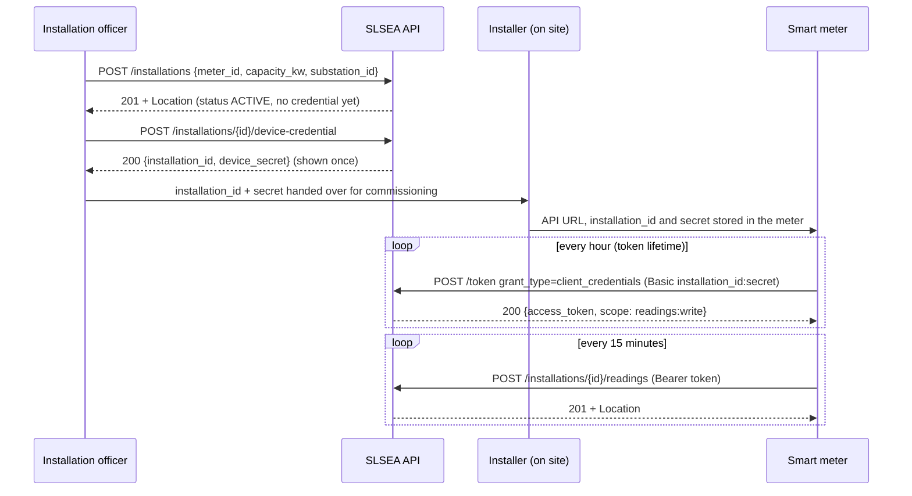
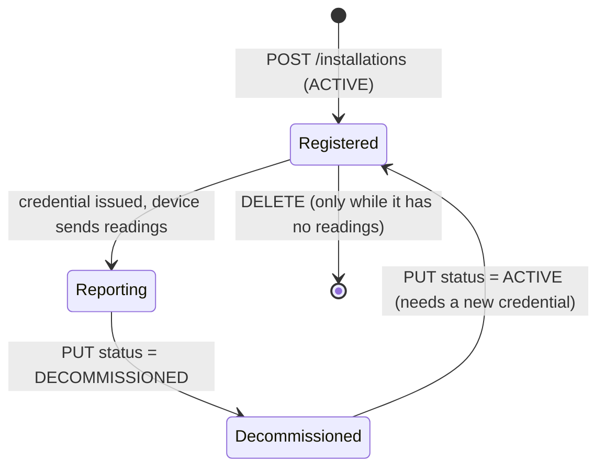

# 03 — API Design (resources, URIs, representations, methods, headers, status codes, security)

**Project:** NB6007CEM — SLSEA Real-Time Solar Generation Data API
**Status:** v6.5 — deviation "MongoDB vs in-memory seed" withdrawn (the module's lectures use MongoDB Atlas); plain-words note on credential vs token (§9.1). v6.4 — O3 resolved (meter swap: commissioning rule, DM-A3). v6.3 — review against WSO2 and lecture notes S1–S8 (§0.5): token `ver` claim (A4, A7), decommissioned device at `/token` → 401 (EP1, §9.3), origin guard in the check order (M2), second-precision dates (S7), credential handover (§9.1), deviation #12, O2 closed. v6.2 — MongoDB storage reflected (A7, A9, S3). v6.1 — region readings collections (S3, EP17) close the jurisdiction-filter question; deployment in 04. v6 restructured by WSO2 design step. Matches `IMPLEMENTATION-GUIDE.md`. **Ready for coding.**
**Builds on:** 01 data model v5.7 · 02 scope v2.9 · 04 architecture v2.3

> Working notes, not report text. Write the report in your own words.

---

## 0. About this log

### 0.1 How to read it
- Sections 2–9 follow the **WSO2 design approach step by step** (G§2, Figure 1), plus security (G§12), which the lecture treats as step 8.
- Each step has the same layout:
  1. **What the guideline asks** (one or two lines).
  2. **Decision table:** `ID · Decision · Why · Source`.
- Section 10 is the **endpoint reference**: one card per URI with methods, scope, headers, request and response bodies, errors and the decisions behind it.
- Sections 11–15: deviations, coverage, viva answers, open items, ID map.

### 0.2 Reference keys

| Key | Source |
|---|---|
| **G§x** | WSO2 REST API Design Guidelines — the design standard (B§13) |
| **L-Sx** | Lecture notes, session x (tuk-tuk teaching system) |
| **B§x** | Coursework brief |
| **R-Dx** | Rubric dimension x |
| **RFC xxxx** | Internet standard. G§13 [12] cites RFC 6749 (OAuth 2.0) as the basis of G§12.2 |
| **DM-x** | 01 data model log |
| **SC-x** | 02 scope log |

### 0.3 How conflicts are settled
- WSO2 is the standard (B§13). The lecture notes are the module's reading of it, and the lecturer marks.
- Where we depart from either, it is stated where it happens and listed in **section 11**.

### 0.4 What changed in v6

| Change | Why |
|---|---|
| Layout follows WSO2's steps instead of lecture sessions | Easier to read; each decision sits under the guideline step it answers |
| Token endpoint follows RFC 6749: form-encoded body, devices authenticate with HTTP Basic | G§12.1 allows Basic "for requests that generate more secure access tokens"; Swagger's **Authorize** button then works |
| Tokens are checked against the store on every request | A deleted user, a changed password, a re-issued credential or a decommissioned site loses access **immediately** |
| New `POST /users/{user-id}/password` | Users change their own password; an ADMIN can reset one. Otherwise the ADMIN knows everyone's password |
| Bootstrap ADMIN **is** `hq.admin` | One admin account, not two |
| Decommissioning revokes the device credential | A shut-down site's secret should not survive |
| `meter_id` and `capacity_kw` validation stated | Were unspecified |
| Device provisioning, account and decommissioning **flows** drawn | They were spread over several sections |

### 0.5 What changed in v6.3 (review against WSO2 and the lecture notes)

| Change | Why |
|---|---|
| Tokens carry `ver` (credential version); revocation compares `ver`, not `iat` (A4, A7) | `iat` has whole-second precision: a token fetched in the same second as a password change would be refused, and one fetched just before could survive |
| A decommissioned device asking for a token gets **401 `40103`**, not 403 (EP1, §9.3) | Decommissioning deletes the credential, so the device can no longer prove who it is; E4 promises one answer for every credential failure, and a 403 would tell an unauthenticated caller that the installation exists |
| Check order starts with the origin guard (M2) | It was in 04 §3.1 but missing here |
| `Last-Modified` / `If-Modified-Since` compared at whole seconds (S7) | HTTP dates have no milliseconds; otherwise a 304 never matches |
| Credential handover = `installation_id` + secret (§9.1) | The meter needs both to log in; `meter_id` is never used for login |
| Deviation #12 (403/404 vs G§12.3's 401) | Visible to a marker; must be defended |
| O2 closed | No lecture material exists after S8; WSO2 G§10–§12 is the authority for those steps |

---

## 1. The API on one page

Base: `https://{host}/solar/v1.0`. JSON everywhere (except the `/token` request body, A3). No verbs in any path.

| # | Path (after base) | Methods → scope | Type (G§4) | Success | Card |
|---|---|---|---|---|---|
| 1 | `/token` | POST → none | Processing (POST only) | 200 | EP1 |
| 2 | `/provinces` · `/provinces/{province-id}` | GET → `geography:read` | Collection · Atomic | 200 / 304 | EP2 |
| 3 | `/districts` · `/districts/{district-id}` | GET → `geography:read` | Collection · Atomic | 200 / 304 | EP3 |
| 4 | `/substations` · `/substations/{substation-id}` | GET → `geography:read` | Collection · Atomic | 200 / 304 | EP4 |
| 5 | `/districts/{district-id}/generation-summary` · `/provinces/{province-id}/generation-summary` · `/generation-summary` | GET → `generation:read` | Processing (derived read) | 200 / 304 | EP5 |
| 6 | `/installations` | GET → `generation:read` · POST → `installations:write` | Collection (factory) | 200 / 304 · 201 | EP6 |
| 7 | `/installations/{installation-id}` | GET → `generation:read` · PUT, DELETE → `installations:write` | Atomic | 200 / 304 · 200 · 200 | EP7 |
| 8 | `/installations/{installation-id}/overview` | GET → `generation:read` | Composite | 200 / 304 | EP8 |
| 9 | `/installations/{installation-id}/last-known-reading` | GET → `generation:read` | Processing (derived read) | 200 / 304 | EP9 |
| 10 | `/installations/{installation-id}/readings` | GET → `generation:read` · POST → `readings:write` | Scoped collection (factory) | 200 / 304 · 201 | EP10 |
| 11 | `/installations/{installation-id}/readings/{reading-id}` | GET → `generation:read` | Member of scoped collection | 200 / 304 | EP11 |
| 12 | `/installations/{installation-id}/device-credential` | POST → `credentials:issue` | Processing (POST only) | 200 | EP12 |
| 13 | `/users` | GET, POST → `users:manage` | Collection (factory) | 200 / 304 · 201 | EP13 |
| 14 | `/users/{user-id}` | GET, PUT, DELETE → `users:manage` | Atomic | 200 / 304 · 200 · 200 | EP14 |
| 15 | `/users/{user-id}/password` | POST → `account:write` (own) or `users:manage` (reset) | Processing (POST only) | 200 | EP15 |
| 16 | `/districts/{district-id}/readings` · `/provinces/{province-id}/readings` | GET → `generation:read` | Scoped collection (read-only, by region) | 200 / 304 | EP17 |

**Tooling (no token, outside the resource model):** `GET /` health · `GET /solar/v1.0/docs` Swagger UI · `GET /solar/v1.0/openapi` OpenAPI document (EP16).

---

## 2. Step 1 — Data model (G§3)

**G§3 asks:** a conceptual (ER) model of the data, implementation-independent, made **before** any resource, URI or format decision.

| ID | What the API takes from 01 | Source |
|---|---|---|
| D-1 | Five-entity tree Province → District → GridSubstation → SolarInstallation → GenerationReading, plus User | B§3; DM §1–§3 |
| D-2 | `meter_id` is an attribute of SolarInstallation; there is no Device entity | B§3; DM-D1 |
| D-3 | GenerationReading is an append-only time series (`recorded_at`, `power_kw`, `energy_kwh`, `voltage`) | B§3; DM-D2, DM-D9 |
| D-4 | An installation's district and province come only through its substation | DM-D4 |
| D-5 | User = role + jurisdiction level + posting district | B§3 "a role and a jurisdiction"; DM-D6, DM-D7 |
| D-6 | Installation `status` ACTIVE / DECOMMISSIONED; delete only without readings | DM-D12 |
| D-7 | Derived values (last-known reading, reporting status, totals) are never stored | DM-D13 |

- Order of work: 01 was finished before 03 was started (B§ Appendix A "data model precedes design"; L-S1).

---

## 3. Step 2 — Derive resources (G§4)

**G§4 asks:** decide which entities become atomic, collection, composite, controller and processing-function resources. "Clients win over data" (G§3).

| ID | Decision | Why | Source |
|---|---|---|---|
| R1 | The resource model follows client needs, not the ER diagram one-to-one | Collections and summaries have no entity; readings never become top-level | G§2, G§3; L-S3 |
| R2 | **Atomic:** province, district, substation, installation, user | Each passes all three tests: used in several scenarios, handled without traversal, exchanged whole | G§4.1, G§4.6; L-S3 |
| R3 | **Collections:** provinces, districts, substations (catalogue only); installations, users (catalogue + creation); readings (catalogue + creation, scoped) | "A collection resource is a factory for its members"; geography is read-only reference data | G§4.2, G§4.6, G§7.3; SC-S4; L-S3, L-S7 |
| R4 | **Readings are a scoped collection** under their installation (where they are created); one reading is addressable for Location; a **read-only** view of the same readings is also scoped under each district and province (S3) | No client wants every reading nationally; a 201 must point at something that resolves | G§4.6, G§5.6, G§7.3; B§5; R-D2; L-S3, L-S8 |
| R5 | No geographic nesting; everything except readings is first-class | Each full set is meaningful; subsets are filters; installations and users can move, so nested URIs would change their identity | G§4.6, G§7.1; L-S3 depth rule; DM-D3 |
| R6 | **Composite:** installation overview, **separate** from the atomic installation | (1) the newest reading changes every 15 min — inside the atomic it would break `If-Match` on every PUT; (2) PUT would have to send back derived data; (3) the brief lists both | G§4.3, G§10.5, G§7.2; B§5 · differs from L-S5 (§11 #4) |
| R7 | **Processing functions:** last-known reading, generation summary (3 levels), device credential, password, token | Derived reads and actions that are not CRUD on one entity | G§4.5; B§5 "processing-style"; L-S5 |
| R8 | **No controllers** | No call has to change several resources together | G§4.4; L-S5 |
| R9 | `status` and `reporting_status` are values **inside** resources, not resources | A URI per property multiplies endpoints; subsets are filters | G§6, G§7.1, G§10.5 |
| R10 | No Device, no global `/readings` | No Device entity; a national list of every reading fails the scoping test (no client needs it) | DM-D1; B§3; L-S3 |

**Atomic test (R2)**

| Entity | Several scenarios | No traversal | Whole unit | Result |
|---|---|---|---|---|
| Province · District · Substation | menus, filters, overview | yes | yes | Atomic |
| SolarInstallation | browse, CRUD, overview | yes | yes | Atomic |
| User | admins manage accounts | yes | yes | Atomic |
| GenerationReading | history, created reading | **no** (needs its installation) | yes | Scoped member |

---

## 4. Step 3 — Representations (G§6)

**G§6 asks:** decide the information content and data structure of each resource, then its rendering (media type). One representation usually suffices.

| ID | Decision | Why | Source |
|---|---|---|---|
| P1 | **JSON only.** `Accept` must allow `application/json`, else 406 | The brief requires JSON; one representation suffices; format chosen by header, never URL | B§5; G§6 note; G§10.1 note; L-S5 |
| P2 | **snake_case** field names everywhere, including errors (`more_info`) | Lecture rule; matches the data model; one style in every body | L-S5, L-S6; R-D2 "consistent" · deviates from G§11 `moreInfo` (§11 #2) |
| P3 | Timestamps ISO 8601 in UTC (`Z`); input must carry an offset; "today" = `Asia/Colombo` | An instant without offset cannot be placed in time | DM-D11; SC G10 |
| P4 | References are id fields (`substation_id`, …); no hypermedia | Information content = attributes + "identifiers of associated resources"; Level 3 out of scope | G§6; G§1; brief cover table |
| P5 | A representation is a **view**: secrets, `received_at`, `created_at`/`updated_at` are not returned | Secrets must never leave; bookkeeping describes the system, not the domain | G§6 "a view onto the resource"; DM-D16 |
| P6 | Every collection: `{ count, next, previous, items }`, absolute links | The guideline names exactly these three fields; one parser for every collection | G§10.3; B§5; R-D3 |
| P7 | Unknown body fields → 400 | A typo is rejected, not silently ignored | — (strict contract) |
| P8 | Request bodies are JSON, **except `/token`**, which takes `application/x-www-form-urlencoded` | RFC 6749 defines the token request that way; it is what OAuth clients and Swagger send | RFC 6749 §4.3.2, §4.4.2; G§13 [12] |

Shapes for every resource are in the cards (section 10).

---

## 5. Step 4 — Name resources by URIs (G§5)

**G§5 asks:** `{scheme}://{host}/{base-path}/{path}[?{query}]`, with nouns, lower case, hyphens, plural collections and URI templates.

| ID | Decision | Why | Source |
|---|---|---|---|
| U1 | HTTPS only | Credentials and tokens must never travel in clear text | G§5.2, G§12.1; B§7; L-S7 |
| U2 | Base path **`/solar/v1.0`** | Feature code + `v` major.minor; unknown version → 404 now, 301 to the latest once a v2.0 exists | G§5.4, G§5.5 · differs from L-S4 root routes (§11 #3) |
| U3 | Five naming rules, **enforced in code** with strict and case-sensitive routing | Express otherwise accepts `/installations/` and `/Installations` | G§5.1; L-S3 |
| U4 | Collection names: `provinces`, `districts`, `substations`, `installations`, `readings`, `users` | Plain plurals; `solar`/`grid`/`generation` already clear from base path or parent | G§4.2, G§5.1; L-S3 (`/stations`) · `substations` vs `grid-substations` (§11 #10) |
| U5 | Template variables `{entity-id}`: `{province-id}`, `{installation-id}`, … | Lecture convention; clear which entity the value identifies | G§5.6; L-S3 |
| U6 | Ids: readable codes for geography (`nuwara-eliya`), UUIDs for installations, readings, users | Stable reference data; system-assigned ids elsewhere | DM-D15 |
| U7 | **Processing functions are nouns, placed under the resource they belong to** | One decision covering all three G§5.1 sub-rules (verbs; not sub-resources; ids as parameters). See below | L-S5; R-D2 · deviates from G§5.1 (§11 #1) |
| U8 | Query parameter = attribute name with hyphens (`district-id`, `reporting-status`, `jurisdiction-level`, `sort=recorded-at:desc`) | A filter is a condition over attributes; no underscores in any URI | G§10.2, G§5.1 |
| U9 | No file extensions: `/openapi`, not `/openapi.json` | Format belongs in `Content-Type`/`Accept`; one resource, one URI | L-S5; G§6 |

**U7 in full — the one deliberate departure from G§5.1**
- G§5.1 says processing functions "should be named as verbs", "should not be sub-resources of individual other resources", and "individual resources become parameters".
- L-S5 (refining L-S3): "derived-read processing functions are named as nouns … verbs are only correct for controllers", and it places `/last-position` under its vehicle. R-D2 marks "verbs avoided".
- G§5.1's own reason for verbs is that these resources "represent 'actions'":
  - `last-known-reading` and `generation-summary` have no side effects → not actions.
  - `device-credential`, `password` and `token` **are** actions. Applying the noun rule to them **extends** L-S5; each is named by **what it produces or replaces**, the way a collection is named by what POST creates in it.
- G§5.7 supports keeping identifiers in the path (the area identifies which summary you get) — supporting reasoning, not the main reason.

**Rejected URIs**

| A generator may produce | Rule broken | Correct |
|---|---|---|
| `/api/v1/…` | G§5.4, G§5.5 | `/solar/v1.0/…` |
| `/getInstallations`, `/installationList`, `/installation` | nouns, hyphens, plural | `/installations` |
| `/Grid_Substations`, `/gridSubstations` | lower case, hyphens | `/substations` |
| `/readings`, `/readings?installation-id=…`, `/readings/{reading-id}` | scoping (R4) | `/installations/{installation-id}/readings[/{reading-id}]` |
| `/installations/id/readings` | literal instead of template | `/installations/{installation-id}/readings` |
| `/summarize-generation?district=…` | verb; id in query (U7) | `/districts/{district-id}/generation-summary` |
| `/issue-device-credential`, `/login`, `/change-password` | verbs (U7) | `…/device-credential`, `/token`, `…/password` |
| `/installations/{id}/decommission` | action as sub-resource; PUT suffices (R9) | `PUT /installations/{installation-id}` |
| `/devices`, `/meters/{meter-id}` | no Device entity | — |
| `/openapi.json`, `/installations.json` | extensions (U9) | `/openapi`, `/installations` |
| trailing slash, upper case | U3 | — (404) |

---

## 6. Step 5 — HTTP methods, headers and status codes (G§7–§9)

**G§7–§9 ask:** map CRUD to POST/GET/PUT/DELETE with the right safety and idempotency, use the standard headers, and return specific status codes.

| ID | Decision | Why | Source |
|---|---|---|---|
| M1 | GET for every read; POST to create or trigger; PUT full replacement; DELETE remove. No PATCH, no GET with a body | Safe/idempotent contract; PATCH problems; filters go in the query string | G§7, G§4.5 note; L-S7 |
| M2 | **Fixed check order** for every request (below) | The same mistake always gets the same answer; a repeated DELETE gives 404, not 412 | G§9, G§7.4; L-S7, L-S8 |
| M3 | Every POST that creates → **201** + `Location` + `Content-Location` + `ETag` + `Last-Modified`, body = the new resource | "A created resource must report where it now lives" | G§7.3, G§9; B§5; L-S7 "mandatory", L-S8 |
| M4 | **PUT is a full replacement**; every field required; **`If-Match` required** (missing → 403, stale → 412) | No partial PUT; two officers cannot overwrite each other | G§7.2, G§10.5, G§9 (its own 403 example); L-S7 |
| M5 | Ingestion: installation taken from the **token**; path must match; `installation_id` in the body rejected; device time and server time both kept | A device writes only its own readings; resolves the L-S8 timestamp trade-off | DM-R10, DM-D9; L-S7, L-S8 |
| M6 | Resend of the same reading → **200** with the existing one; different values at the same time → **409** | POST is not idempotent; a retry must never duplicate | G§7.3; DM-D8; SC G5 |
| M7 | DELETE → 200 with the deleted representation; again → 404. Installation with readings → **409** "decommission instead" | G§7.4 behaviour; history is never destroyed | G§7.4; DM-D12 · differs from L-S7 (§11 #6) |
| M8 | A POST that creates no resource returns **200** (token, credential, password, identical retry) | Nothing new to point a Location at | G§9 200; L-S7 |
| M9 | Every 405 carries `Allow` | HTTP requires it; tells the client what is possible | RFC 9110 §15.5.6 |

**Check order (M2)**

| Step | Check | Failure |
|---|---|---|
| 0 | Production only: `X-Origin-Secret` added by API Gateway matches (04 AR3) | 403 `40309` |
| 1 | `Accept` allows JSON | 406 |
| 2 | Valid, unexpired bearer token whose subject still exists and is current (A7) | 401 + `WWW-Authenticate` |
| 3 | Token has the route's scope | 403 `40301` |
| 4 | Request `Content-Type`, then syntax and fields | 415, then 400 |
| 5 | Target exists and is inside the caller's area · area outside the caller's area · device writing another installation | 404 · 403 `40302` · 403 `40306` |
| 6 | `If-Match` present and current | 403 `40303` · 412 |
| 7 | Business rules | 409 · 403 `40304`, `40305`, `40307`, `40308` |

**Status codes**

| Code | Used for | Source |
|---|---|---|
| 200 | GET, PUT, DELETE success; POST that creates nothing | G§9; L-S7 |
| 201 | POST that creates (installations, readings, users) | G§9; L-S7 |
| 304 | Conditional GET, client copy current (empty body) | G§9, G§10.4 |
| 400 | Malformed or invalid request | G§9 |
| 401 | Missing/invalid/expired token; wrong credentials at `/token` — always `WWW-Authenticate` | G§9, G§12.1; RFC 6750 §3 |
| 403 | Identity known, not allowed; `If-Match` missing | G§9 |
| 404 | Not found; hidden asset outside the caller's area | G§9 |
| 405 | Method not supported on a known path, with `Allow` | RFC 9110 |
| 406 · 415 | Unsupported `Accept` · request `Content-Type` | G§9, G§10.1 |
| 409 | State conflict (duplicates, conflicting reading, delete with readings) | RFC 9110 · not in G§9's list (§11 #9) |
| 412 | Stale `If-Match` | G§9, G§10.5 |
| 5xx | Generic, not documented per endpoint | G§9 note |

**Headers**

| Header | Direction | When | Source |
|---|---|---|---|
| `Accept` | request | every request | G§8.1, G§10.1 |
| `Authorization: Bearer …` | request | every route except `/token` and tooling | G§12.2 |
| `Authorization: Basic …` | request | `/token`, device client authentication | G§12.1; RFC 6749 §2.3.1 |
| `Content-Type` | request | POST/PUT with a body | G§8.1 |
| `If-Match` | request | **required** on PUT and DELETE | G§8.1, G§10.5 |
| `If-None-Match` · `If-Modified-Since` | request | optional on GET | G§8.1, G§10.4 |
| `Content-Type` | response | every body | G§8.2 |
| `ETag` · `Last-Modified` | response | every successful GET, 201 and PUT; `ETag` also on 304 | G§8.2, G§7.3; L-S7 |
| `Location` + `Content-Location` | response | every 201 | G§7.3, G§8.2 |
| `Content-Location` | response | last-known reading; identical reading retry | G§8.2 |
| `Allow` | response | every 405 | RFC 9110 |
| `WWW-Authenticate` | response | every 401: `Bearer realm="solar"` (+ `error="invalid_token"` for a bad token); `Basic realm="solar"` on `/token` | G§8.2, G§9; RFC 6750 §3 |
| `Cache-Control: no-store` + `Pragma: no-cache` | response | `/token`, device credential, password | RFC 6749 §5.1 |

- Every URL in a header or body is absolute (G§9: "the URL of the newly created entity").

---

## 7. Step 6 — Special behaviour (G§10)

**G§10 asks:** content negotiation, queries, pagination, client-side caching, concurrency control and long-running requests, as needed.

| ID | Decision | Why | Source |
|---|---|---|---|
| S1 | Server-driven content negotiation; JSON only; anything else → 406 | "Even in case an API … supports only one media type … must return 406" | G§10.1 |
| S2 | Each collection lists its filters; unknown parameter or value → 400 | A typo must not silently return unfiltered data | G§10.2 |
| S3 | **Jurisdiction filtering on the history:** read-only readings collections scoped by region — `/districts/{district-id}/readings` and `/provinces/{province-id}/readings` — with `substation-id` (and `district-id` on provinces), time window, sort and paging. Installations are filtered by region too | Meets B§5's "filtering by jurisdiction … on the history" literally, and B§6's "over time and by region" | B§5, B§6; G§4.6, G§5.6; L-S3, L-S4 |
| S4 | Readings: `sort=recorded-at:desc` (default) or `recorded-at:asc` | Sort = attribute + direction; newest first is what dashboards read | G§10.2 |
| S5 | Paging with `offset` (0) and `limit` (20, max 100); response `count`, `next`, `previous` | The guideline's own field names; a cap protects the server | G§10.3 |
| S6 | Time window `from` (inclusive), `to` (exclusive), offset required | Back-to-back windows never count a reading twice | G§10.2; DM-D11 |
| S7 | **Conditional GET everywhere:** strong ETag = hash of the body (summaries exclude `computed_at`); `Last-Modified` = stored time where reliable, else the time the response is built; `If-None-Match` wins; 304 has an empty body | Every retrievable resource can return 304, and a wrong 304 is impossible | G§10.4; B§5 |
| S8 | Optimistic concurrency: `If-Match` required on PUT and DELETE | Lost-update protection | G§10.5 |
| S9 | No long-running requests (no 202) | Every request completes quickly | G§10.6 |

**S3 in full — jurisdiction filtering on the history**
- **The brief:** B§5 lists "filtering, at least by jurisdiction (province / district / substation) and by time window" under "advanced behaviour **on the history**"; B§6 asks "how has generation behaved over time **and by region**?". R-D3 marks "filtering by jurisdiction and by time window".
- **The problem with filtering one installation's readings by region:** they all sit in one substation, district and province, so the filter is meaningless.
- **Decision:** two **read-only** collections of readings, scoped by region in the path:
  - `GET /districts/{district-id}/readings?substation-id=&from=&to=&sort=&offset=&limit=`
  - `GET /provinces/{province-id}/readings?district-id=&substation-id=&from=&to=&sort=&offset=&limit=`
- **Why this is not the lecture's "global /pings" mistake:**
  - L-S3 rejects a **national** list of every ping and **query-string scoping** (`/pings?vehicleId=`). Here the parent (district or province) is in the **path** (G§5.6; L-S3 "path-level scoping"), and there is no national list.
  - The scoping test is a client need (L-S3): "how did Colombo generate this week?" is a real analyst question; "every reading in the country" is not.
  - The region identifies which readings you get, so it belongs in the path (G§5.7).
- **What stays the same:**
  - Readings are **created** only under their installation (`POST /installations/{installation-id}/readings`); each reading's canonical URI stays there (Location, Content-Location).
  - Area rules are the summary's rules: a region outside the caller's area → 403; unknown region → 404.
  - Installations can also be filtered by region (`/installations?district-id=…`), as in L-S4's `/vehicles?province-id=1`.
- **Cost:** one shared database query (readings whose `installation_id` is in the region's installations, filtered by time, sorted, paged) using the (`installation_id`, `recorded_at`) index.

**Last-Modified values (S7)**

| Resource | Value |
|---|---|
| Province, district, substation (and their lists) | `updated_at` (seed time) |
| Installation, user | `updated_at` |
| Reading, last-known reading | `received_at` |
| Readings collection | newest `received_at` of the installation (append-only, so always correct) |
| Installations list, users list, overview, summaries, region readings | time the response is built (deletions, moves or time passing can change them) |

- **Precision:** HTTP dates have whole seconds. `Last-Modified` is sent rounded down to the second, and `If-Modified-Since` is compared with the stored time rounded down the same way; otherwise a 304 would never match.

---

## 8. Step 7 — Errors (G§11)

**G§11 asks:** on every 4xx, return an error object with a product-specific `code`, a `message`, and optionally `description`, `moreInfo` and an `error` list.

| ID | Decision | Why | Source |
|---|---|---|---|
| E1 | One body for every 4xx and 5xx: `code`, `message`, `description`, `more_info`, `error[]` | One consistent schema across the whole API | G§11; B§5 |
| E2 | Five-digit codes = HTTP status + two digits (`40302`, `40901`) | "A product-specific error code"; readable at a glance | G§11 |
| E3 | `error[]` lists each field problem when there are several | Validation errors listed per field | G§11 |
| E4 | Errors never leak: one 401 message for every credential failure; hidden assets are 404; no stack traces | No cross-jurisdiction leakage; no hints to attackers | R-D7 |
| E5 | `/token` errors use the same body, not RFC 6749's `{ error, error_description }` | The brief requires one schema everywhere | B§5 · deviates from RFC 6749 §5.2 (§11 #8) |

```json
{ "code": 40001, "message": "The request body has invalid fields.", "description": "Validation failed",
  "more_info": "https://{host}/solar/v1.0/docs#errors",
  "error": [ { "code": 40001, "message": "capacity_kw must be greater than 0" } ] }
```

The full code catalogue is in guide §5.2.

---

## 9. Step 8 — Security (G§12)

**G§12 asks:** a permission model; OAuth bearer tokens with **scopes designed along with the API**; Basic only over HTTPS or "for requests that generate more secure access tokens"; finer, attribute-based control (ABAC) where scopes are not enough.

| ID | Decision | Why | Source |
|---|---|---|---|
| A1 | **Write-read split:** devices only write readings for their own installation; people never write readings | "The device writes. The police read." | B§2; L-S1; R-D7 |
| A2 | **OAuth 2.0 bearer tokens** for both client types, from one token endpoint | Scopes live in tokens; one mechanism to explain and test | G§12.2; R-D7 "JWT bearer with scopes"; L-S13 |
| A3 | **`POST /token` follows RFC 6749:** form-encoded; `grant_type=password` (users) or `client_credentials` (devices); devices authenticate with **HTTP Basic** (`installation_id:device_secret`); response `access_token`, `token_type`, `expires_in`, `scope`; `no-store` | G§12.1 allows Basic exactly here; standard OAuth clients and Swagger's **Authorize** button work unchanged | G§12.1, G§12.2; RFC 6749 §2.3.1, §3.2, §4.3, §4.4, §5.1 |
| A4 | Tokens are **JWT** (HS256, 60 min) with `iss`, `aud`, `sub`, `iat`, `exp`, `jti`, `scope`, plus `typ` (`user`/`device`) and `ver` (credential version: when the password was last set, or the device secret issued, in milliseconds); `iss` and `aud` are checked | Standard claims; a token from another system is rejected; `ver` makes revocation exact (A7) | RFC 7519; RFC 9068 |
| A5 | **Scopes per client** (table below), one per route method | "A set of scopes needs to be designed … along with the APIs" | G§12.2 note |
| A6 | **Areas:** level + posting give a set of districts; assets outside it → 404 (hidden), an area outside it → 403; provinces, districts and substations are public reference data | Scopes say *what kind* of thing; the area says *which ones* — attribute-based control | G§12.3 (ABAC); R-D7 "no cross-jurisdiction leakage"; DM-D6 |
| A7 | **Every request re-checks the store:** the subject still exists (a user's role, level and posting are read from the store, never from the token); the token's `ver` must equal the current password or device-secret version, so a password change, a credential re-issue or decommissioning ends every older token | Immediate revocation without a deny-list; one indexed lookup per request. Not `iat`: it is in whole seconds, so a token fetched in the same second as a change would be judged wrongly | R-D7; RFC 7519 §4.1.6 |
| A8 | Passwords: bcrypt, min 10 characters, never returned. Device secrets: 32 random bytes, stored as SHA-256, shown once | A leaked store does not reveal credentials | G§12 |
| A9 | **First account:** `hq.admin` (NATIONAL ADMIN) created at start-up from secret environment variables when no user exists; everyone else, including the marker's test accounts, through `POST /users` | Someone must exist before anyone can be created through the API; same pattern as Keycloak's and Grafana's bootstrap admin | DM-D19; SC-S7 |
| A10 | **Passwords:** a user changes their own (with the current one); an ADMIN resets someone else's | Otherwise the ADMIN knows everyone's password; ownership is the guideline's own permission example | G§12 ("the user who created a shopping cart …"); G§7.2 / G§4.5 (dedicated resource for a partial update) |
| A11 | **Decommissioning revokes the device credential** | A shut-down site's secret must not survive; reactivation needs a new credential | DM-D12; R-D7 |

**Scopes (A5)**

| Client | Scopes in the token |
|---|---|
| Device | `readings:write` |
| ANALYST | `geography:read generation:read account:write` |
| INSTALLATION_OFFICER | `geography:read generation:read installations:write credentials:issue account:write` |
| ADMIN (always NATIONAL) | `geography:read users:manage account:write` |

**Considered and rejected**

| Option | Why not |
|---|---|
| Device sends its key on every request (`X-API-Key`, L-S7–S8) | No scopes; secret sent every 15 minutes instead of once an hour; R-D7 asks for bearer + scopes |
| Basic auth on every read (L-S7–S8) | Carries no role or area; password on every request |
| A long-lived device token handed out at registration | A stateless JWT cannot be revoked; a leaked one works until it expires |
| Device client certificates (mTLS) | API Gateway terminates TLS before the app, so the app never sees the certificate; meters would also need certificate provisioning |
| OAuth device-authorization grant (RFC 8628) | For devices acting **for a person**; our meter acts as itself → client credentials is the right grant |
| Full OAuth server (authorization-code flow, refresh tokens, introspection) | Needs a login UI (B§13 backend only); R-D7 says it is not required |

### 9.1 Device registration and authentication flow



- **The credential is a pair:** `installation_id` (the OAuth client id, not secret) and `device_secret` (private, shown once, stored only as a hash). `meter_id` is never used to log in; it records which hardware is fitted and stops one meter being registered twice.
- **In plain words — the meter holds a key, not a pass.** The installer stores the *credential* once, like typing a Wi-Fi password into a new router. Nobody ever copies a token into the meter: the meter swaps its credential for a 60-minute token by itself, every hour, for the rest of its life. The credential is long-lived and revocable by the officer; the token is short-lived and carries the scope `readings:write`.
- **Why a token at all, not the secret on every reading:** the secret travels once an hour instead of every 15 minutes; the token carries scopes (R-D7); and it expires on its own if it leaks.
- **Registration and authentication are two different steps.** The officer registers the *site* and issues its credential once. `/token` is how the *device* uses that credential, on its own, for the rest of its life (B§2: "the device pushes readings on its own").
- **Meter swap:** officer updates `meter_id` (PUT) and issues a new credential; the old secret and every token from it stop working at once (A7). The installer sets the new meter to continue the old counter (DM-A3), so the counter check (`40005`) needs no special case.
- **Leak:** issue a new credential — same effect.
- **What happens outside the API:** the physical installation and typing the secret into the meter. They are field work, not API calls.

### 9.2 User accounts flow

| Step | Who | Call |
|---|---|---|
| 1 | Deployment | `hq.admin` is created at first start-up (A9) |
| 2 | `hq.admin` | `POST /users` with a first password → 201 |
| 3 | New user | `POST /token` (`grant_type=password`) → token |
| 4 | New user | `POST /users/{own-id}/password` with current + new password → 200; older tokens stop working |
| 5 | ADMIN | `PUT /users/{user-id}` (promotion, transfer) — takes effect on the user's next request (A7) |
| 6 | ADMIN | `POST /users/{user-id}/password` (reset, no current password) when someone forgets it |
| 7 | ADMIN | `DELETE /users/{user-id}` for a leaver — their tokens stop working at once |

- An ADMIN cannot change or delete their **own** account through `PUT`/`DELETE` (stops self-promotion and the last admin locking everyone out) but can change their own password (step 4).

### 9.3 Installation lifecycle and decommissioning



| While DECOMMISSIONED | Behaviour |
|---|---|
| Device token request | 401 `40103` — the credential was removed, so the device can no longer prove who it is (E4) |
| Device writes (even with an unexpired token) | 403 `40304` |
| Issuing a credential | 403 `40304` (reactivate first) |
| Stored credential | removed when the status changes to DECOMMISSIONED (A11) |
| History | fully readable |
| `reporting_status` | `null` |
| Summaries | not in current power or active counts; energy it produced earlier today still counts; counted under `decommissioned` |
| Listing | still in `/installations`; `?status=ACTIVE` hides it |
| Delete | refused while it has readings (409 `40903`) |

- **Who:** an installation officer for an installation in their area. **How:** an ordinary conditional PUT of the full record with `status` changed (G§10.5; R9).
- **Reactivation:** PUT `status` back to ACTIVE, then issue a new credential.

---

## 10. Endpoint reference

**Common to every card (not repeated):**
- Request: `Accept: application/json`; `Authorization: Bearer <token>` (except EP1, EP16).
- Response: `Content-Type: application/json; charset=utf-8`; errors use the E1 body.
- Every GET: `ETag` + `Last-Modified`; `If-None-Match` / `If-Modified-Since` → 304, empty body.
- 401 (`40101` no token, `40102` bad, expired or revoked token) with `WWW-Authenticate`; 403 `40301` missing scope; 405 with `Allow`; 406.

### EP1 — `POST /token`

| | |
|---|---|
| Type · scope | Processing function · none · `Allow: POST` |
| Request headers | `Content-Type: application/x-www-form-urlencoded`; devices: `Authorization: Basic base64(installation_id:device_secret)` |
| Success | 200 · `Cache-Control: no-store` · `Pragma: no-cache` |

**Request (user)**
```
grant_type=password&username=colombo.analyst&password=…
```
**Request (device)** — with the Basic header
```
grant_type=client_credentials
```
**Response 200**
```json
{ "access_token": "eyJ…", "token_type": "Bearer", "expires_in": 3600, "scope": "geography:read generation:read account:write" }
```

| Error | Code | When |
|---|---|---|
| 400 | `40001` | missing or unknown `grant_type`; missing fields |
| 401 | `40103` | wrong username/password, wrong device credentials, or a device whose credential was removed by decommissioning — one message · `WWW-Authenticate: Basic realm="solar"` |
| 415 | `41501` | body not form-encoded |

**Decisions:** A2, A3, A4, M8, E5. Device client credentials may also be sent as `client_id`/`client_secret` form fields (RFC 6749 §2.3.1 allows it); Basic is preferred.

### EP2 — `/provinces` · `/provinces/{province-id}`

| | |
|---|---|
| Type · scope | Collection · Atomic · `geography:read` · `Allow: GET` |
| Query | `offset`, `limit` |

```json
{ "province_id": "western", "name": "Western" }
```

| Error | Code | When |
|---|---|---|
| 400 | `40002` | unknown or invalid query parameter |
| 404 | `40401` | unknown `province-id` |

**Decisions:** R2, R3 (catalogue only), U6, S7 (Last-Modified = seed time).

### EP3 — `/districts` · `/districts/{district-id}`

| | |
|---|---|
| Type · scope | Collection · Atomic · `geography:read` · `Allow: GET` |
| Query | `province-id`, `offset`, `limit` |

```json
{ "district_id": "colombo", "name": "Colombo", "province_id": "western" }
```

| Error | Code | When |
|---|---|---|
| 400 | `40002` | unknown parameter; `province-id` that does not exist |
| 404 | `40401` | unknown `district-id` |

**Decisions:** R5 (filter, not nesting), U8, L-S5 (FK field in every member).

### EP4 — `/substations` · `/substations/{substation-id}`

| | |
|---|---|
| Type · scope | Collection · Atomic · `geography:read` · `Allow: GET` |
| Query | `province-id`, `district-id`, `offset`, `limit` |

```json
{ "substation_id": "kotugoda", "name": "Kotugoda", "district_id": "gampaha" }
```

| Error | Code | When |
|---|---|---|
| 400 | `40002` | unknown parameter or value |
| 404 | `40401` | unknown `substation-id` |

**Decisions:** public reference data (A6) — officers need the full list; nothing about SLSEA assets is revealed. U4 name.

### EP5 — Generation summaries

| | |
|---|---|
| Paths | `/districts/{district-id}/generation-summary` · `/provinces/{province-id}/generation-summary` · `/generation-summary` |
| Type · scope | Processing (derived read) · `generation:read` · `Allow: GET` |
| Who | district: area contains it · province: area contains the whole province · national: NATIONAL only |

```json
{
  "area": { "level": "DISTRICT", "id": "colombo", "name": "Colombo" },
  "day": "2026-10-04",
  "computed_at": "2026-10-04T08:20:11Z",
  "current_power_kw": 412.338,
  "energy_today_kwh": 1820.104,
  "installations": { "active": 22, "reporting": 20, "silent": 1, "never_reported": 1, "decommissioned": 1 }
}
```

| Error | Code | When |
|---|---|---|
| 403 | `40302` | area outside the caller's area |
| 404 | `40401` | unknown district or province |

**Decisions:** B§5 stretch, extended to every level (DM-D6); R7, U7; **ETag ignores `computed_at`** so 304 works (S7). Calculation: guide §5.5.

### EP6 — `/installations`

| | |
|---|---|
| Type · scope | Collection (factory) · GET `generation:read` · POST `installations:write` · `Allow: GET, POST` |
| Query (GET) | `province-id`, `district-id`, `substation-id`, `status`, `reporting-status`, `offset`, `limit` |
| Success | GET 200 / 304 · POST 201 + `Location` + `Content-Location` + `ETag` + `Last-Modified` |

**Request (POST)**
```json
{ "meter_id": "SLM-10000241", "capacity_kw": 5.0, "substation_id": "kolonnawa" }
```
**Response (member, and the 201 body)**
```json
{ "installation_id": "3f0c…", "meter_id": "SLM-10000241", "capacity_kw": 5.0, "status": "ACTIVE", "substation_id": "kolonnawa" }
```

| Error | Code | When |
|---|---|---|
| 400 | `40001` | missing/invalid field; `meter_id` not 3–32 of `A–Z 0–9 -`; `capacity_kw` not > 0 and ≤ 1000; unknown `substation_id`; `status` in the body |
| 400 | `40002` | unknown parameter or value |
| 403 | `40302` | filter or `substation_id` outside the caller's area |
| 409 | `40902` | `meter_id` already in use (by any installation, decommissioned included) |
| 415 | `41501` | body not JSON |

**Decisions:** R3 factory, M3, S3 (jurisdiction filters live here), R9 (`reporting-status` filter, ACTIVE only), new installations start ACTIVE (DM-D12), lists narrowed to the area (A6).

### EP7 — `/installations/{installation-id}`

| | |
|---|---|
| Type · scope | Atomic · GET `generation:read` · PUT, DELETE `installations:write` · `Allow: GET, PUT, DELETE` |
| Request headers | PUT, DELETE: **`If-Match` required** |
| Success | GET 200 / 304 · PUT 200 + new `ETag` · DELETE 200 |

**Request (PUT)** — every field required
```json
{ "meter_id": "SLM-10000241", "capacity_kw": 6.0, "status": "DECOMMISSIONED", "substation_id": "kolonnawa" }
```

| Error | Code | When |
|---|---|---|
| 400 | `40001` | missing field (no partial PUT); invalid value |
| 403 | `40302` | moving to a substation outside the caller's area |
| 403 | `40303` | `If-Match` missing |
| 404 | `40401` | not found, outside the area, or already deleted |
| 409 | `40902` | `meter_id` in use |
| 409 | `40903` | DELETE while readings exist |
| 412 | `41201` | stale `If-Match` |
| 415 | `41501` | body not JSON |

**Decisions:** M4, M7, R9 + §9.3 (decommission and reactivation are PUTs; decommission removes the credential); moving needs both substations in the area (SC G4); OpenAPI declares `If-Match` as required.

### EP8 — `/installations/{installation-id}/overview`

| | |
|---|---|
| Type · scope | Composite · `generation:read` · `Allow: GET` |

```json
{
  "installation": { "installation_id": "3f0c…", "meter_id": "SLM-10000241", "capacity_kw": 5.0, "status": "ACTIVE", "substation_id": "kolonnawa" },
  "substation":   { "substation_id": "kolonnawa", "name": "Kolonnawa" },
  "district":     { "district_id": "colombo", "name": "Colombo" },
  "province":     { "province_id": "western", "name": "Western" },
  "reporting_status": "REPORTING",
  "last_known_reading": { "reading_id": "…", "installation_id": "3f0c…", "recorded_at": "2026-10-04T08:15:00Z", "power_kw": 3.412, "energy_kwh": 10234.551, "voltage": 236.4 }
}
```

| Error | Code | When |
|---|---|---|
| 404 | `40401` | not found or outside the area |

**Decisions:** R6; `last_known_reading` `null` when none; `reporting_status` `null` when DECOMMISSIONED; ETag changes when the reading or status changes, so a 304 never hides a newly SILENT site.

### EP9 — `/installations/{installation-id}/last-known-reading`

| | |
|---|---|
| Type · scope | Processing (derived read) · `generation:read` · `Allow: GET` |
| Success | 200 / 304 + `Content-Location` = the reading's own URI |

Response: the reading (EP10).

| Error | Code | When |
|---|---|---|
| 404 | `40401` | installation not found or outside the area |
| 404 | `40402` | no readings yet |

**Decisions:** B§5 "derived resource rather than a raw row lookup"; L-S5 `/last-position` shape (reading only); R7, U7.

### EP10 — `/installations/{installation-id}/readings`

| | |
|---|---|
| Type · scope | Scoped collection (factory) · GET `generation:read` · POST `readings:write` (this installation's device) · `Allow: GET, POST` |
| Query (GET) | `from`, `to`, `sort`, `offset`, `limit` |
| Success | GET 200 / 304 · POST 201 + `Location` + `Content-Location` + `ETag` + `Last-Modified` · identical resend 200 + `Content-Location` |

**Request (POST)**
```json
{ "recorded_at": "2026-10-04T08:15:00Z", "power_kw": 3.412, "energy_kwh": 10234.551, "voltage": 236.4 }
```
**Response (member, and the 201 body)**
```json
{ "reading_id": "9a1b…", "installation_id": "3f0c…", "recorded_at": "2026-10-04T08:15:00Z", "power_kw": 3.412, "energy_kwh": 10234.551, "voltage": 236.4 }
```

| Error | Code | When |
|---|---|---|
| 400 | `40001` | missing/invalid field; `installation_id` in the body |
| 400 | `40002` | unknown parameter; bad `sort` |
| 400 | `40003` | time without offset; > 2 min in the future; > 7 days old; `from` ≥ `to` |
| 400 | `40004` | `power_kw` < 0 or > capacity × 1.05; `voltage` outside 180–270; `energy_kwh` < 0 |
| 400 | `40005` | energy below the reading just before, or above the one just after (by `recorded_at`) |
| 403 | `40304` | installation DECOMMISSIONED |
| 403 | `40306` | device token for a different installation |
| 404 | `40401` | (GET) installation not found or outside the area. A device whose installation was deleted fails the token check first → 401 `40102` |
| 409 | `40901` | different values already stored for this `recorded_at` |
| 415 | `41501` | body not JSON |

**Decisions:** R4, M3, M5, M6, S4–S7.

### EP11 — `/installations/{installation-id}/readings/{reading-id}`

| | |
|---|---|
| Type · scope | Member of scoped collection · `generation:read` · `Allow: GET` |

| Error | Code | When |
|---|---|---|
| 404 | `40401` | not found, outside the area, or belongs to another installation |

**Decisions:** R4 (exists so every Location resolves); append-only — PUT and DELETE → 405 (DM-R3; L-S7); its ETag never changes.

### EP12 — `/installations/{installation-id}/device-credential`

| | |
|---|---|
| Type · scope | Processing (POST only) · `credentials:issue` · `Allow: POST` |
| Request | no body |
| Success | 200 · `Cache-Control: no-store` · `Pragma: no-cache` |

```json
{ "installation_id": "3f0c…", "device_secret": "…", "issued_at": "2026-10-04T08:20:11Z" }
```

| Error | Code | When |
|---|---|---|
| 403 | `40304` | installation DECOMMISSIONED |
| 404 | `40401` | not found or outside the area |

**Decisions:** §9.1; M8 (200, nothing addressable created); GET → 405 because a secret is stored only as a hash; not returned in the installation's 201 because a 201 body should equal what GET returns (G§7.3); a new secret revokes the old one and its tokens (A7).

### EP13 — `/users`

| | |
|---|---|
| Type · scope | Collection (factory) · `users:manage` · `Allow: GET, POST` |
| Query (GET) | `district-id`, `role`, `jurisdiction-level`, `offset`, `limit` |
| Success | GET 200 / 304 · POST 201 + `Location` + `Content-Location` + `ETag` + `Last-Modified` |

**Request (POST)**
```json
{ "name": "Nimali Perera", "username": "nimali.p", "password": "…", "role": "ANALYST", "jurisdiction_level": "DISTRICT", "district_id": "kandy" }
```
**Response (member, and the 201 body)** — never a password
```json
{ "user_id": "7c2d…", "name": "Nimali Perera", "username": "nimali.p", "role": "ANALYST", "jurisdiction_level": "DISTRICT", "district_id": "kandy" }
```

| Error | Code | When |
|---|---|---|
| 400 | `40001` | missing/invalid field; password under 10 characters; ADMIN not NATIONAL |
| 400 | `40002` | unknown parameter or value |
| 409 | `40904` | `username` already in use |
| 415 | `41501` | body not JSON |

**Decisions:** §9.2; ADMIN is national, so `/users` is not narrowed (DM-R13); password write-only (P5).

### EP14 — `/users/{user-id}`

| | |
|---|---|
| Type · scope | Atomic · `users:manage` · `Allow: GET, PUT, DELETE` |
| Request headers | PUT, DELETE: **`If-Match` required** |

**Request (PUT)** — every field of the representation; no password
```json
{ "name": "Nimali Perera", "username": "nimali.p", "role": "ANALYST", "jurisdiction_level": "PROVINCIAL", "district_id": "kandy" }
```

| Error | Code | When |
|---|---|---|
| 400 | `40001` | missing field; `password` present; ADMIN not NATIONAL |
| 403 | `40303` | `If-Match` missing |
| 403 | `40305` | an ADMIN changing or deleting their own account |
| 404 | `40401` | not found or already deleted |
| 409 | `40904` | `username` in use |
| 412 | `41201` | stale `If-Match` |

**Decisions:** M4 — the password is not part of the representation (P5), so PUT neither sends nor changes it; passwords have their own resource (EP15). Changes take effect on the user's next request (A7).

### EP15 — `/users/{user-id}/password`

| | |
|---|---|
| Type · scope | Processing (POST only) · own password: `account:write` · someone else's: `users:manage` · `Allow: POST` |
| Success | 200 · `Cache-Control: no-store` |

**Request (own password)**
```json
{ "current_password": "…", "new_password": "…" }
```
**Request (ADMIN reset of another user)**
```json
{ "new_password": "…" }
```
**Response 200**
```json
{ "user_id": "7c2d…", "password_changed_at": "2026-10-04T08:20:11Z" }
```

| Error | Code | When |
|---|---|---|
| 400 | `40001` | missing field; new password under 10 characters or equal to the current one |
| 403 | `40307` | current password wrong |
| 403 | `40308` | not your own account and not an ADMIN |
| 404 | `40401` | unknown user |

**Decisions:** A10; R7, U7 (named by what it replaces); M8 (200); every older token of that user stops working (A7).

### EP17 — `/districts/{district-id}/readings` · `/provinces/{province-id}/readings`

| | |
|---|---|
| Type · scope | Scoped collection, read-only (by region) · `generation:read` · `Allow: GET` |
| Query | district: `substation-id`; province: `district-id`, `substation-id`; both: `from`, `to`, `sort` (`recorded-at:desc` default / `recorded-at:asc`), `offset`, `limit` |
| Who | district: area contains it · province: area contains the whole province |
| Success | 200 / 304 |

**Response:** the collection envelope (P6) of readings (EP10 shape). Equal `recorded_at` values are ordered by `installation_id`, so pages never shift.

| Error | Code | When |
|---|---|---|
| 400 | `40002` | unknown parameter; filter value not in this region; bad `sort` |
| 400 | `40003` | time without offset; `from` ≥ `to` |
| 403 | `40302` | region outside the caller's area |
| 404 | `40401` | unknown district or province |

**Decisions:** S3; R4 (created only under the installation; canonical URI stays there); `Last-Modified` = build time (a moved installation can change membership without a newer reading).

### EP16 — Tooling

| Path | Response |
|---|---|
| `GET /` | 200 `{ "status": "ok", "service": "slsea-solar-api" }` — health check |
| `GET /solar/v1.0/docs` | Swagger UI, with OAuth2 **password** and **client-credentials** flows pointing at `/solar/v1.0/token` |
| `GET /solar/v1.0/openapi` | OpenAPI document (`application/json`) |

---

## 11. Deviation register

B§13: "Where a choice is contested, justify it against the guidelines."

| # | Decision | Deviates from | Reason | Ref |
|---|---|---|---|---|
| 1 | Processing functions are nouns under their parent, ids in the path | G§5.1 (three sub-rules) | L-S5; R-D2 "verbs avoided"; derived reads are not actions; actions named by what they produce | U7 |
| 2 | `more_info` | G§11 `moreInfo` | one snake_case style in every body | P2 |
| 3 | Base path `/solar/v1.0` | L-S4 (routes at the root) | G§5.4–5.5 | U2 |
| 4 | Composite separate from atomic | L-S5 (member is the composite) | ETag churn; PUT round-trip | R6 |
| 5 | Bearer tokens for devices | L-S7/S8 (`X-API-Key`) | scopes need tokens (R-D7); G§12.1–12.2; L-S13 | A2, A3 |
| 6 | Delete refused while readings exist | L-S7 (delete, keep pings) | no orphan readings; same goal | M7 |
| 7 | 401 for wrong credentials | L-S8 prompt (403) | G§9; L-S7 | §6 |
| 8 | `/token` errors use the API's error body; wrong user password is 401 | RFC 6749 §5.2 (`invalid_grant`, 400) | B§5 one error schema; G§9 401 "credentials are not accepted" | E5 |
| 9 | 409 for state conflicts | not in G§9's list | the list is not closed; 400 would wrongly say "malformed" | M6, M7 |
| 10 | `/substations` | G§4.2 plural of entity name (`grid-substations`) | only grid substations exist; matches `substation_id`; L-S3 `/stations` | U4 |
| 11 | OAuth `password` grant for users | OAuth security advice (RFC 9700) | no login UI in a backend-only API (B§13); R-D7 does not require a full server | A3 |
| 12 | Area denials are 403 (an area) or 404 (a hidden asset), not 401 | G§12.3 (an XACML PEP returns 401 for anything but Permit) | we use scopes + an area check, not XACML; G§9 reserves 401 for missing or rejected credentials; L-S7 uses 403 for another district | A6 |

- **Richardson level:** cite G§2 ("RESTful (Level 2) API"). G§1 says Level 1 — the paper contradicts itself.

---

## 12. Coverage

### 12.1 Brief (B§5, B§6)

| Requirement | Where |
|---|---|
| Collections and atomics for provinces, districts, substations, installations | EP2–EP4, EP6–EP7 |
| Scoped collection where it only makes sense under a parent | EP10 (R4) |
| Installation composite | EP8 |
| Last-known reading, derived | EP9 |
| Ingestion with the right method, status and headers; Location | EP10, EP11 (M3, M5) |
| CRUD with correct methods and idempotency | EP7, EP14 (M4, M7) |
| Pagination with count, next, previous | P6, S5 |
| Filtering by jurisdiction and time window | S3 (EP17, EP6), S6 |
| Sorting by timestamp both ways | S4 |
| Conditional GET → 304 | S7 |
| One error schema | E1 |
| Device authenticates as its installation; district user cannot read another district | A2–A7, §9.1 |
| District generation summary (stretch) | EP5 |

### 12.2 Rubric First-band items

| Rubric item | Where |
|---|---|
| R-D2: taxonomy correct and derived from the model | §3; 12.3 |
| R-D2: lower case, hyphenated, plural, nouns, verbs avoided | §5 |
| R-D2: scoped sub-collections | R4 |
| R-D2: methods match semantics; no PUT for partial update | M1, M4 |
| R-D2: 201 + Location; 200, 404, 400, 406, 412 | §6 status table |
| R-D2: Location, ETag, Last-Modified, Content-Type | §6 header table |
| R-D3: pagination, filtering, sorting, conditional GET, error contract, summary | §7, §8, EP5 |
| R-D7: write path per installation; JWT bearer with scopes; no cross-jurisdiction leakage; HTTPS; scope-vs-ABAC trade-off | §9 |

### 12.3 Traceability — entity → resources

| Entity (DM) | Resources |
|---|---|
| Province | EP2; its summary (EP5); part of EP8 |
| District | EP3; its summary (EP5); part of EP8 |
| GridSubstation | EP4; part of EP8 |
| SolarInstallation | EP6, EP7; centre of EP8; parent of EP9–EP12 |
| GenerationReading | EP10, EP11, EP17; EP9; input to EP5 and EP8 |
| User | EP13, EP14, EP15; the subject of a user token (EP1) |
| (no entity — client need) | collections (R3), summaries (EP5), overview (EP8), token (EP1), device credential (EP12), password (EP15) |

---

## 13. Viva — strongest answers

| Question | Answer |
|---|---|
| How does a meter get onto the system? | The officer registers the site and issues a credential; the installer stores it in the meter; from then on the meter gets a token with client credentials and posts readings on its own (§9.1). |
| Why `/token`? Is that a standard? | It is the OAuth 2.0 token endpoint (RFC 6749 §3.2), which G§12.2 builds on (G§13 [12]). Client credentials is the standard grant for a machine acting as itself; G§12.1 allows Basic exactly for token requests (A3). |
| Why not just an API key, as in the lecture? | Keys carry no scopes and are sent on every request; R-D7 asks for bearer tokens with scopes (A2, §9 rejected options). |
| How do you create the first admin? | `hq.admin` is created at start-up from secret environment variables — the usual bootstrap pattern (A9). |
| Can a deleted user keep using their token? | No. Every request re-checks the store (A7). |
| What does decommissioning do? | Stops writes and tokens, revokes the credential, keeps history, leaves the site out of current figures (§9.3). |
| Why are readings nested but installations not? | Scoping test (R4, R5). |
| Where is jurisdiction filtering on the history? | `/districts/{id}/readings` and `/provinces/{id}/readings`, filterable by substation and time — region in the path, so it is scoped, not the lecture's global `/pings` (S3). |
| G§5.1 says processing functions are verbs. Why not here? | One deliberate decision covering all three sub-rules, following L-S5 and R-D2; G§5.1's reason (actions) does not apply to derived reads; actions are named by what they produce (U7). |
| Why is the composite separate? | ETag churn, then PUT round-trip, then the brief's wording (R6). |
| Why can a summary still return 304? | Its ETag ignores `computed_at` (S7). |
| Why 404 for one installation but 403 for a district filter? | Assets are hidden; geography is public, so refusing reveals nothing (A6). |
| Why does a repeated DELETE give 404, not 412? | Existence is checked before preconditions (M2). |

---

## 14. Open items and limitations

| # | Item |
|---|---|
| O1 | ~~Jurisdiction filtering on the history~~ — resolved in v6.1 by S3 / EP17 |
| O2 | ~~Compare §7–§9 with the S9, S11, S13 lecture notes~~ — closed in v6.3: there is no lecture material after S8, so WSO2 G§10–§12 is the authority for those steps, with RFCs where it is silent (§11) |
| O3 | ~~Meter swap and the energy counter~~ — resolved: commissioning rule (DM-A3; 02 L6) |

- Limitations are listed in 02 (L1–L15).

---

## 15. Old → new IDs

| v5 | v6 | v5 | v6 |
|---|---|---|---|
| A2, A3 | R2, R3 | E2 | M2 |
| A4 | R4, R5 | E3, E4 | §6 tables |
| A5 | U2 | E5.1 | M5 |
| A6 | U3–U6 | E5.2 | M6 |
| A7 | §5 rejected URIs | E5.3 | M4 |
| B1 | §7 | E5.4 | M7 |
| B2 | S3 | F1 | A2, A3 |
| B3 | U8 | F2 | A5 |
| C1–C5 | P1–P7 | F3 | A6 |
| C6 | R6 | Part G (G1–G15) | EP1–EP16 |
| C7 | R7 | Part H | §7, §8 |
| C8 | U7 | Part I | §11 |
| C9 | R8 | | |
| C10 | R9 | | |
