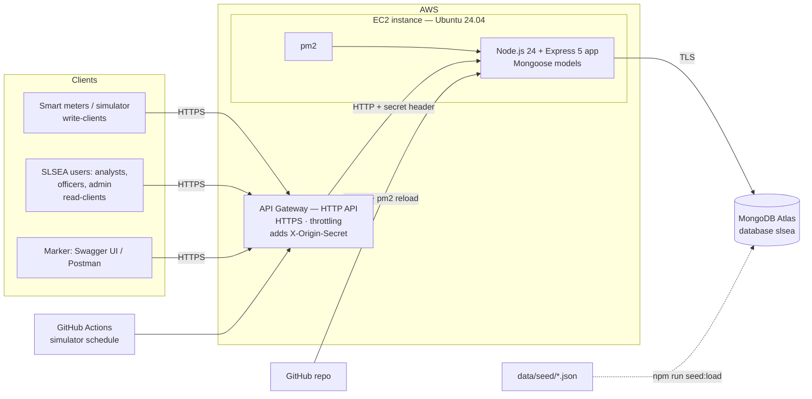

# 04 — Architecture and Deployment (Design Log)

**Project:** NB6007CEM — SLSEA Real-Time Solar Generation Data API
**Status:** v2.3 — seed loaded by `scripts/load-seed.js` instead of a manual Compass import (AR7). v2.2 — in-memory row reworded: the module's lectures also use MongoDB Atlas. v2.1 — controllers layer (§3.2); gateway is a pure pass-through (AR14); gateway-made responses and free-plan expiry added to the limitations (AL4, AL5); simulator hosting reopened (O1). v2 — MongoDB Atlas as the database; local-first build. Matches `IMPLEMENTATION-GUIDE.md` §2 and §6.
**Builds on:** 01 data model v5.7 · 02 scope v2.9 · 03 API design v6.5

> Working notes, not report text. This log feeds the report's "Architecture and data model" and "Deployment" sections (B§8; R-D1, R-D6).

### Reference keys

| Key | Source |
|---|---|
| **H1–H5** | Lecturer's coursework help points (below) |
| **B§x · R-Dx · G§x** | Brief · Rubric dimension · WSO2 guidelines |
| **DM · SC · 03** | Design logs 01, 02, 03 |

---

## 1. The help points and how this design meets them

| # | Help point | How it is met | Where |
|---|---|---|---|
| H1 | Data modelling first; explain the whole backend through the data model | One Mongoose model and one collection per entity of 01; every route traces back to an entity (03 §12.3) | AR1, §3 |
| H2 | AWS API Gateway can be used — easier TLS/SSL | API Gateway (HTTP API) is the only public entry point; AWS manages the HTTPS certificate | AR2, AR3 |
| H3 | pm2, nodemon to keep the service alive | pm2 runs the app in production (restart on crash, start on boot, zero-downtime reload); nodemon in development | AR4 |
| H4 | Never everything on one exposed EC2 instance; no plain-text URL | Three separate parts: gateway (edge), EC2 (app), MongoDB Atlas (data). The instance refuses requests that did not come through the gateway | AR2, AR3, AR5 |
| H5 | Correct content headers (JSON) and good use of HTTP codes | One media type, `Content-Type` on every body, a fixed status-code contract | 03 §4, §6 |

---

## 2. System architecture



- **One public URL:** `https://<api-id>.execute-api.<region>.amazonaws.com/solar/v1.0`.
- **Write path and read path meet only at the API.** Devices hold a `readings:write` token; users hold read or admin scopes (03 §9).
- **Development is the same shape without AWS:** the app on `localhost:3000` (nodemon) talks to a local MongoDB; the seed files are loaded into it with `npm run seed:load`.

---

## 3. Inside the application

### 3.1 Request pipeline (one fixed order — 03 M2)

| Step | Layer | Checks |
|---|---|---|
| 0 | Origin guard | `X-Origin-Secret` matches (production) → else 403 `40309` |
| 1 | Content negotiation | `Accept` allows JSON → else 406 |
| 2 | Authentication | Bearer JWT valid; subject still current in the database → else 401 |
| 3 | Scope | Token has the route's scope → else 403 |
| 4 | Body parsing | `Content-Type`, syntax, fields → 415 / 400 |
| 5 | Handler | target exists and is in the area; `If-Match`; business rules |
| 6 | Response helpers | ETag, Last-Modified, collection envelope, error body |

### 3.2 Code layout follows the data model (H1)

```
src/
  server.js            start-up: connect to MongoDB, sync indexes, bootstrap hq.admin, listen
  app.js               middleware order (3.1), routers, 404/405, error handler
  config.js            environment variables
  models/              one Mongoose model per entity (01): Province, District, Substation,
                       Installation, Reading, User — fields and indexes as in the guide §3.2
  routes/              wiring only — one router per resource family (03): token, geography,
                       installations, readings, region-readings, summaries, users
  controllers/         one per router: read the request, call lib/models, send the response
  middleware/          origin, negotiation, auth, scope, conditional, errors
  lib/                 shared logic: area (DM-D6), derived values (DM-D13), etag, pagination,
                       validation, representations
  openapi/             the OpenAPI document served at /solar/v1.0/openapi
scripts/               generate-seed.js, load-seed.js, db-check.js, simulate.js
data/seed/             the seed files (one per collection; readings.json is git-ignored)
```

- **Files follow what the code does, not the first word of the URI.** `/districts/{id}/readings` lives in `region-readings` (it reuses the readings query), and all three `generation-summary` routes live in `summaries` (one calculation). Express mounts several routers under the same prefix without conflict.
- **Each path is declared once** with `router.route(path)`, its methods chained, and `.all(methodNotAllowed(...))` last, so the 405 and `Allow` header sit next to the methods they describe.
- **Viva rule of thumb:** for any line of code, name the entity (01) or the resource (03) it serves.
- **Write-read split visible in code:** only `routes/readings` accepts device tokens, and only for `POST`; every read goes through the area helper.
- **Representations are built explicitly** (`lib/representations`): MongoDB's `_id` and secrets never leave the server (03 P5).

---

## 4. Decisions

| ID | Decision | Why | Source |
|---|---|---|---|
| AR1 | One model and one collection per entity; code organised by entity and resource | The backend is explained through the data model; R-D2 asks for resources "derived from the model" | H1; R-D1, R-D2 |
| AR2 | **Edge, compute and data are separate:** API Gateway → one EC2 instance → MongoDB Atlas | TLS, throttling and the public URL live at the edge; the instance only runs the app; the data lives in a managed service | H2, H4; B§7; R-D6 |
| AR3 | **HTTPS only for clients; the instance accepts only gateway traffic.** The gateway adds `X-Origin-Secret`; the app refuses requests without it (403 `40309`) | No plain-text public URL; the EC2 address is useless on its own | H4; G§5.2, G§12.1; B§13 |
| AR4 | **pm2 in production** (`ecosystem.config.js`: restart on crash, start on boot, logs, reload); **nodemon** in development | Keeps the service alive; R-D6 "operational" | H3; R-D6 |
| AR5 | **MongoDB Atlas** (free M0 cluster) holds all data; local MongoDB in development | A document database stores the model's objects directly; data survives restarts and deploys; Atlas is managed, encrypted in transit (TLS) and reachable only from allowed IPs; it is also the database used in the module's lectures | H4; DM-N6 |
| AR6 | Atlas network access: the EC2 Elastic IP only (your own IP only while loading the seed) | The database is never open to the internet | R-D7 |
| AR7 | Seed files generated by `npm run seed` and **loaded by a script** (`npm run seed:load`) | The seed stays visible and repeatable; one command fills local or Atlas; indexes are built right after loading; `users` is never touched. The brief requires the data, not a loading method | SC-S6; B§4 |
| AR8 | Throttling at the gateway (rate 50, burst 100) | Cheap protection, including against password guessing at `/token` | H2; R-D7 |
| AR9 | Configuration and secrets in environment variables (`.env`, never committed) | Secrets stay out of the repository | R-D7 |
| AR10 | **Local first:** everything is built and accepted on `localhost` (phases L0–L12) before deployment (D1–D5) | Problems are found where they are cheap to fix; every phase is still its own commit | R-D6 "per-increment commit history" |
| AR11 | Deploy = `git pull` + `npm ci` + `pm2 reload` | Simple and repeatable | H3 |
| AR12 | *(Provisional — see O1)* Simulator on a GitHub Actions schedule, not on the instance | Keeps "now" views current during marking; a client does not live inside the server | H4; SC L13 |
| AR13 | Swagger UI and the OpenAPI document are served by the app, through the gateway | Live documentation at the same HTTPS URL | B§7; R-D6 |
| AR14 | **API Gateway is a pure pass-through:** routes `ANY /` and `ANY /{proxy+}` only; no per-route definitions and no gateway JWT authorizer | Routing, authentication, scopes and every error stay in one place (the app), so every 4xx keeps the one error body (B§5); moving from local to AWS changes environment variables only, not code | B§5; G§11; AR10 |

### Considered and rejected

| Option | Why not |
|---|---|
| In-memory store loaded from `seed.json` (the lectures' early-session starting point, S2–S4) | Data created through the API would vanish on every restart or deploy; the lectures themselves move to MongoDB Atlas |
| Render (taught in S2) | Works and has HTTPS, but does not follow the help points; the free tier sleeps. Kept only as an emergency fallback |
| EC2 alone, app on port 80 | Plain-text URL; everything on one exposed instance (H4; B§7) |
| Nginx + Let's Encrypt on the instance | Needs a domain and certificate renewal; puts TLS on the same box as the app (H4) |
| MongoDB installed on the EC2 instance | Data and app on one box (H4); no managed backups |
| AWS Lambda | Cold starts and per-invocation database connections add complexity for no gain here |
| Private integration (VPC link + load balancer) | Encrypts the gateway → instance hop, but a load balancer is not free; the origin secret is enough here |

---

## 5. Limitations (for the critical evaluation)

| # | Limitation |
|---|---|
| AL1 | One EC2 instance: no redundancy across machines (pm2 restarts the process; Atlas keeps the data) |
| AL2 | The gateway → instance hop is plain HTTP, protected by the origin secret, not encrypted |
| AL3 | The free Atlas M0 tier is small (512 MB, shared CPU); fine for ≈ 160,000 readings, not for years of history |
| AL4 | Free-tier limits and costs must be watched (budget alert set up first). On AWS's free account plan the account **closes** 6 months after sign-up or when the credits run out; if marking or a resubmission could run later, upgrade to the paid plan first (credits stay valid for 12 months) |
| AL5 | Responses made by the gateway itself — 429 when throttled, 503/504 when the instance is down — use AWS's body, not the API's error schema |

---

## 6. Open items

| # | Item | Options | Needed by |
|---|---|---|---|
| O1 | Where the device simulator runs | (a) GitHub Actions every 15 min — about 96 runs a day, roughly 2,900 billed minutes a month, above GitHub Free's private-repo allowance (check yours; the Student Pack's Pro plan gives more); (b) a separate pm2 process on the EC2 instance that still calls the **public HTTPS URL** like any device, caches device tokens for their hour, costs nothing extra; (c) GitHub Actions every 30 min — sites would flicker to SILENT (threshold 30 min) | D5 |

## 7. What the report's architecture and deployment sections should show

- The diagram in §2 and the pipeline in §3.1.
- How the code mirrors the data model (§3.2) — the "data model first" point (H1).
- The edge / compute / data split and the origin secret (AR2, AR3, AR5), and why not the in-memory store or Render (§4 rejected).
- How it is shown to be operational: HTTPS gateway URL, live Swagger, `pm2 status`, the Newman run against production, the commit history (B§8; R-D6).
